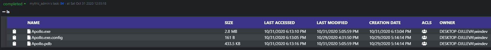
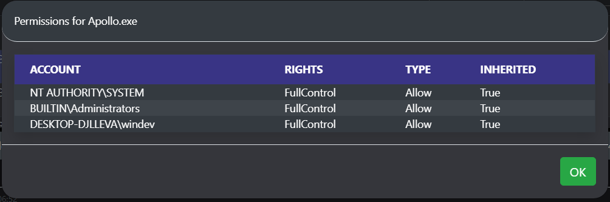
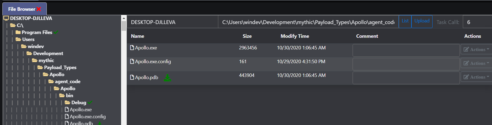
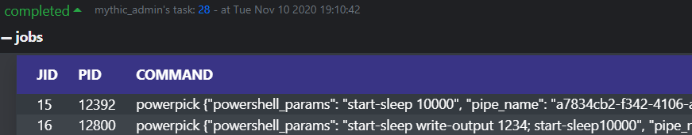

Apollo is a Windows agent written in C# using the 4.0 .NET Framework designed for SpecterOps training offerings. Apollo lacks some evasive tradecraft provided by some commercial and open-source tools, such as more evasive network communications, PE manipulation, AMSI disabling, and otherwise; however, this project (in tandem with Mythic) is designed in a way that encourages students and operators to extend its functionality should they be so motivated.

## Supported C2 Profiles

Currently, only two C2 profiles are available to use when creating a new Apollo agent: HTTP and SMB.

### HTTP Profile

The HTTP profile calls back to the Mythic server over the basic, non-dynamic profile. When selecting options to be stamped into Apollo at compile time, only the following will be respected:

- Callback Interval
- Callback Jitter
- Callback Host
- Callback Port
- Encrypted Key Exchange Check
- Domain Front
- Kill Date
- User Agent

### SMB

The SMB profile only takes a pipe name on compilation. This pipe name can be randomly generated when creating the agent and can be generated based on a provided regex (e.g. `[0-9a-z]{4}\-[0-9a-z]{8}\-[0-9a-z]{8}\-[0-9a-z]{4}`). Currently there's an open issue with SMB messages, so SMB linking is non-functional.

## SOCKSv5 Support

SOCKS support is built-in to the agent and dispatched through the SocksManager file. To start the socks server, issue `socks start [port]`, and to stop it issue `socks stop`. You can view active SOCKS proxies by clicking on the dropdown of a callback and clicking "Socks Proxies."

## Quality of Life Improvements

### File Triage

The `ls` command reports back a wealth of information and allows operators to easily copy file paths and examine permissions of files, in addition to being able to sort and filter files. Clicking the icon under the ACLs column will show all the permissions of a file. Additionally, this hooks into Mythic's native file browser.

This shows typical ls output:

Clicking the ACL icon shows permissions:

Interfaces with Mythic's filebrowser and caches data server-side:

### Process Listings

When issuing `ps_full`, additional details are retrieved such as:
- Company name of the process executable
- Description of the process executable
- Full path of the process
- Integrity level of the process
- Desktop session
- Process command line arguments

This process listing also interfaces with Mythic's builtin process browser, which allows you to see process trees more easily.

### Assembly and PowerShell Script Caching

Apollo can cache one or more .NET assemblies as well as one or more PowerShell Scripts with no size limitation on files.

### Dynamic Injection Techniques

The agent can change what code injection technique is in use by post-exploitation jobs that require injection through a suite of injection commands.

### Job Tracking

Agent jobs are tracked by job ID, by command, and by the arguments passed to the command so that you know what job correlates to what tasking.

### And more!

There's a number of niceities that come with pairing an agent to Mythic C2 - too many to list!

## Commands Manual Quick Reference

Command | Syntax | Description
------- | ------ | -----------
assembly_inject | `assembly_inject [pid] [arch] [assembly] [args]` | Execute .NET assembly in remote process.
bypassuac | `bypassuac (modal popup)` | Bypass UAC using the trusted mock directory technique.
cat | `cat [file]` | Retrieve the output of a file.
cd | `cd [dir]` | Change working directory.
cp | `cp [source] [destination]` | Copy a file from source to destination. Modal popup.
download | `download [path]` | Download a file off the target system.
execute_assembly | `execute_assembly [assembly.exe] [args]` | Execute a .NET assembly registered with `register_assembly`
exit | `exit` | Exit a callback.
get_current_injection_technique | `get_current_injection_technique` | Show the current injection technique used in postex jobs.
getprivs | `getprivs` | Enable as many privileges as possible for the current access token.
inject | `inject` | Inject a new payload into a remote process.
jobkill | `jobkill [jid]` | Kill a running job in the agent.
jobs | `jobs` | List all running jobs.
keylog | `keylog [pid] [arch]` | Inject a keylogger into a remote process.
kill | `kill [pid]` | Attempt to kill the process specified by `[pid]`.
link | `link` | Link to an SMB agent (defunct, modal popup)
list_assemblies | `list_assemblies` | Show the assemblies currently cached by the agent.
list_injection_techniques | `list_injection_techniques` | List all injection techniques the agent can potentially use for postex jobs.
list_scripts | `list_scripts` | List all powershell scripts cached in the agent.
ls | `ls [path]` | List files and folders in `[path]`. Defaults to current working directory.
make_token | `make_token` | Impersonate a user using plaintext credentials. Modal popup.
mimikatz | `mimikatz [args]` | Execute Mimikatz with the specified arguments.
mkdir | `mkdir [dir]` | Create a directory.
mv | `mv [source] [destination]` | Move a file from source to destination. Modal popup.
net_dclist | `net_dclist [domain.local]` | List all domain controllers for the current or specified domain.
net_localgroup | `net_localgroup [computer]` | Retrieve local groups known by a computer. Default to localhost.
net_localgroup_member | `net_localgroup_member` | Retrieve membership information from a specified group on a given computer. Modal popup.
net_shares | `net_shares [computer]` | Show shares of a remote PC.
powerpick | `powerpick [command]` | Executes PowerShell in a sacrificial process.
powershell | `powershell [command]` | Executes PowerShell in your currently running process.
printspoofer | `printspoofer -c [command]` | Execute a command in SYSTEM integrity so long as you have SeImpersonate privileges.
ps_full | `ps_full` | List verbose process information, including company names, command lines, desktop sessions, window titles, and more.
ps | `ps` | List process information.
psclear | `psclear` | Clears all PowerShell scripts known to the agent that were imported by `psimport`.
psexec | `psexec` | Pivot to a remote computer by creating a new service. Modal popup.
psimport | `psimport` | Reigster a powershell script to import on subsequent execution in `powerpick`/`psinject`/`powershell` commands. Can import more than one script (e.g., PowerView and PowerUp can both be loaded simultaneously.) To clear the script imports, use `psclear`.
psinject | `psinject [pid] [x86|x64] [command]` | Executes PowerShell in the process specified by `[pid]`. Note: Currently stdout is not captured of child processes if not explicitly captured into a variable or via inline execution (such as `$(whoami)`).
pth | `pth` | Modal popup. Use Mimikatz to patch LSASS and import credentials into memory.
pwd | `pwd` | Print working directory.
reg_query_subkeys | `reg_query_subkeys` | Query all subkeys of the specified registry path. Needs to be of the format `HKCU:\`, `HKLM:\`, or `HKCR:\`.
reg_query_values | `reg_query_values` | Query all values of the specified registry path. Needs to be of the format `HKCU:\`, `HKLM:\`, or `HKCR:\`.
register_assembly | `register_assembly` | Register an assembly with the agent to execute later in `execute_assembly`. Modal popup for file upload.
rev2self | `rev2self` | Revert the access token to the original access token.
rm | `rm [path]` | Remove a file specified by `[path]`
rmdir | `rmdir [path]` | Remove a directory specified by `[path]`
run | `run [binary.exe] [args]` | Runs the binary specified by `[binary.exe]` with passed arguments (if any).
screenshot | `screenshot` | Get a screenshot of the current screen.
set_injection_technique | `set_injection_technique [technique]` | Set the injection technique used in post-ex jobs that require injection. Must be a technique listed in the output of `list_injection_techniques`.
shell | `shell [command]` | Run a shell command which will translate to a process being spawned with command line: `cmd.exe /C [command]`
shinject | `shinject` | Inject given shellcode into a specified pid. Modal popup.
sleep | `sleep [seconds]` | Set the callback interval of the agent in seconds.
socks | `socks [action] [port]` | Standup the socks server to proxy network traffic. Action must be `start` or `stop`. If `start`, require port.
spawn | `spawn` | Spawn a new callback.
spawnto_x64 | `spawnto_x64 [path]` | Sets the process used in jobs requiring sacrificial processes to the specified `[path]`.
spawnto_x86 | `spawnto_x86 [path]` | Sets the process used in jobs requiring sacrificial processes to the specified `[path]`. 
steal_token | `steal_token [pid]` | Attempts to steal the process's primary token specified by `[pid]` and apply it to our own session.
unlink | `unlink` | Unlink a callback linked to via the `link` command.
unload_assembly | `unload_assembly [Assembly.exe]` | Remove an assembly from the list of loaded assemblies.
upload | `upload` | Upload a file to a remote path on the machine. Modal popup.
whoami | `whoami` | Report access token for local and remote operations.