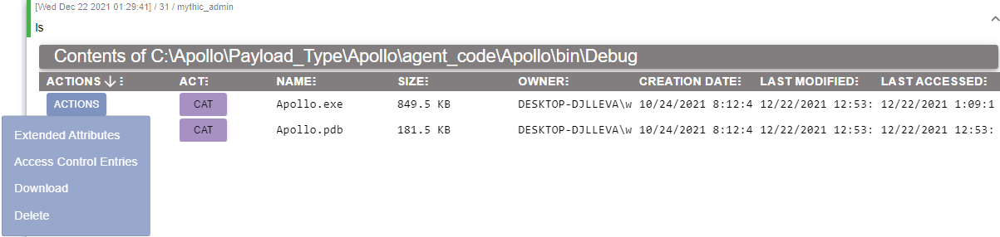
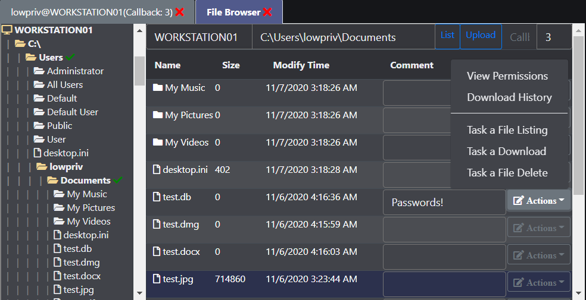
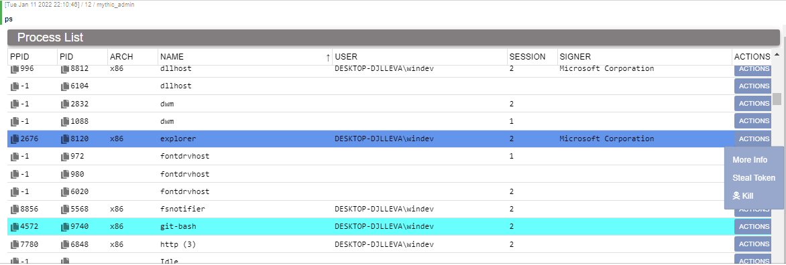
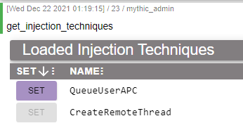
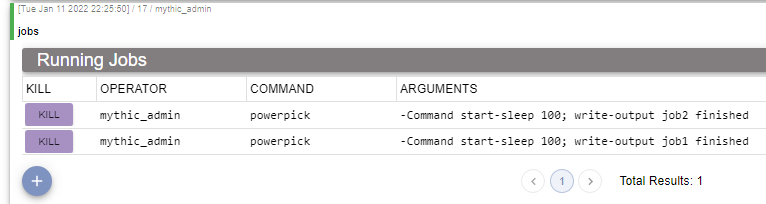
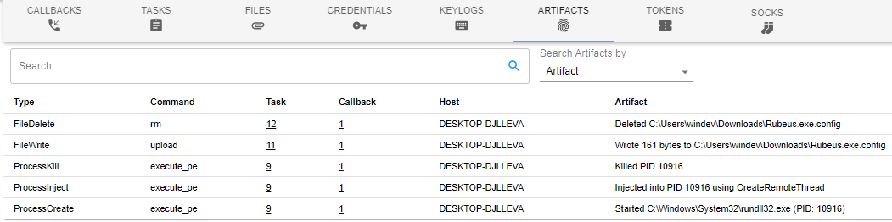

Apollo is a Windows agent written in C# using the 4.0 .NET Framework designed to be used in SpecterOps training offerings.

## Installation
To install Apollo, you'll need Mythic installed on a remote computer. You can find installation instructions for Mythic at the [Mythic project page](https://github.com/its-a-feature/Mythic/).

From the Mythic install directory, use the following command to install Apollo as the **root** user:

```
./mythic-cli install github https://github.com/MythicAgents/Apollo.git
```

From the Mythic install directory, use the following command to install Apollo as a **non-root** user:

```
sudo -E ./mythic-cli install github https://github.com/MythicAgents/Apollo.git
```

Once installed, restart Mythic to build a new agent.

## Notable Features
- P2P Communication
- Credential Tracking and Manipulation
- Unmanged PE, .NET Assembly, and PowerShell Script Execution
- User Exploitation Suite
- SOCKSv5 Support

## Commands Manual Quick Reference

Command | Syntax                                                                                                                   | Description
------- |--------------------------------------------------------------------------------------------------------------------------| -----------
assembly_inject | `assembly_inject -PID [pid] -Assembly [assembly] -Arguments [args]`                                                      | Execute .NET assembly in remote process.
blockdlls | `blockdlls -EnableBlock [false]`                                                                                         | Block non-Microsoft signed DLLs from loading into post-ex jobs.
cat | `cat -Path [file]`                                                                                                       | Retrieve the output of a file.
cd | `cd -Path [dir]`                                                                                                         | Change working directory.
cp | `cp -Path [source] -Destination [destination]`                                                                           | Copy a file from path to destination.
dcsync | `dcsync -Domain contoso.local [-User username -DC dc.ip]`                                                                | DCSync one or more user credentials
download | `download -Path [path] [-Host [hostname]]`                                                                               | Download a file off the target system.
execute_assembly | `execute_assembly -Assembly [assembly.exe] -Arguments [args]`                                                            | Execute a .NET assembly registered with `register_file`
execute_pe | `execute_pe -PE [binary.exe] -Arguments [args]`                                                                          | Execute a statically compiled executable that's been registered with `register_file`
exit | `exit`                                                                                                                   | Task agent to exit.
get_injection_techniques | `get_injection_techniques`                                                                                               | Show currently registered injection techniques as well as the current technique.
getprivs | `getprivs`                                                                                                               | Enable as many privileges as possible for the current access token.
ifconfig | `ifconfig` | Get Network Adapters and Interfaces
inject | `inject`                                                                                                                 | Inject a new payload into a remote process.
inline_assembly | `inline_assembly -Assembly [Assembly.exe] -Arguments [Additional Args]`                                                  | Execute a .NET assembly in the currently executing process that's been registered with `register_file`
jobkill | `jobkill [jid]`                                                                                                          | Kill a running job in the agent.
jobs | `jobs`                                                                                                                   | List all running jobs.
keylog_inject | `keylog_inject -PID [pid]`                                                                                               | Inject a keylogger into a remote process.
kill | `kill -PID [pid]`                                                                                                        | Attempt to kill the process specified by `[pid]`.
link | `link`                                                                                                                   | Link to a P2P agent via SMB or TCP. Modal popup only.
load | `load command1 command2 ...`                                                                                             | Load new commands into the agent.
ls | `ls [-Path [path]]`                                                                                                      | List files and folders in `[path]`. Defaults to current working directory.
make_token | `make_token`                                                                                                             | Impersonate a user using plaintext credentials. Modal popup.
mimikatz | `mimikatz -Command [args]`                                                                                               | Execute Mimikatz with the specified arguments.
mkdir | `mkdir -Path [dir]`                                                                                                      | Create a directory.
mv | `mv -Path [source] -Destination [destination]`                                                                           | Move a file from source to destination. Modal popup.
net_dclist | `net_dclist [domain.local]`                                                                                              | List all domain controllers for the current or specified domain.
net_localgroup_member | `net_localgroup_member -Group [groupname] [-Computer [computername]]`                                                    | Retrieve membership information from a specified group on a given computer.
net_localgroup | `net_localgroup [computer]`                                                                                              | Retrieve local groups known by a computer. Default to localhost.
net_shares | `net_shares [-Computer [computer]]`                                                                                      | Show shares of a remote PC.
netstat | `netstat [-Tcp -Udp -Established -Listen]`                                                                               | Get TCP and UDP connections
powerpick | `powerpick -Command [command]`                                                                                           | Executes PowerShell in a sacrificial process.
powershell | `powershell -Command [command]`                                                                                          | Executes PowerShell in your currently running process.
powershell_import | `powershell_import`                                                                                                      | Register a new .ps1 file to be used in other PowerShell jobs
ppid | `ppid -PID [pid_integer]`                                                                                                | Set the PPID of sacrificial jobs to the specified PID.
printspoofer | `printspoofer -Command [command]`                                                                                        | Execute a command in SYSTEM integrity so long as you have SeImpersonate privileges.
ps | `ps`                                                                                                                     | List process information.
psinject | `psinject -PID [pid] -Command [command]`                                                                                 | Executes PowerShell in the process specified by `[pid]`. Note: Currently stdout is not captured of child processes if not explicitly captured into a variable or via inline execution (such as `$(whoami)`).
pth | `pth -Domain [domain] -User [username] -NTLM [ntlm_hash] [-AES128 [aes128_key] -AES256 [aes256_key] -Run [program.exe]]` | Use `mimikatz`'s pth module to spawn a process with alternate credentials.
pwd | `pwd`                                                                                                                    | Print working directory.
reg_query | `reg_query -Hive [HKCU:\\                                                                                                |HKU:\\|HKLM:\\|HKCR:\] [-Key [keyname]]` | Query all subkeys of the specified registry path. Needs to be of the format `HKCU:\`, `HKLM:\`, or `HKCR:\`.
reg_write_value | `reg_write_value -Hive [HKCU:\                                                                                           |HKU:\|HKLM:\|HKCR:\] -Key [keyname] [-Name [value_name] -Value [value_value]]` | Write specified values to the registry keys.
register_assembly | `register_assembly`                                                                                                      | Register a .NET assembly with the agent to be used in .NET post-exploitation activities
register_file | `register_file`                                                                                                          | Register a file to the agent's file cache. Used to store assemblies, executables, and PowerShell scripts.
rev2self | `rev2self`                                                                                                               | Revert the access token to the original access token.
rm | `rm -Path [path] [-Host [hostname] -File [filename]]`                                                                    | Remove a file specified by `[path]`. Alternatively, if `-File` is provided, `-Path` will be used as the directory, and `-File` will be the filename.
run | `run -Executable [binary.exe] -Arguments [args]`                                                                         | Runs the binary specified by `[binary.exe]` with passed arguments (if any).
sc | `sc [-Query\                                                                                                             |-Start\|-Stop\|-Create\|-Delete] [-Computer [computername] -DisplayName [display_name] -ServiceName [servicename] -BinPath [binpath]]` | .NET implementation of the Service Control Manager.
screenshot_inject | `screenshot_inject -PID [pid] [-Interval [int] -Count [int]]`                                                            | Get a screenshot of the desktop session associated with `PID` every `Interval` seconds for `Count` screenshots.
screenshot | `screenshot`                                                                                                             | Get a screenshot of the current screen.
set_injection_technique | `set_injection_technique [technique]`                                                                                    | Set the injection technique used in post-ex jobs that require injection.
shell | `shell [command]`                                                                                                        | Run a shell command which will translate to a process being spawned with command line: `cmd.exe /S /c [command]`
shinject | `shinject`                                                                                                               | Inject given shellcode into a specified pid. Modal popup only.
sleep | `sleep [seconds]`                                                                                                        | Set the callback interval of the agent in seconds.
socks | `socks -Port [port]`                                                                                                     | Standup the socks server to proxy network traffic, routable via Mythic on `[port]`.
spawn | `spawn`                                                                                                                  | Spawn a new callback in the postex process specified by `spawnto_*`.
spawnto_x64 | `spawnto_x64 -Application [path] -Arguments [args]`                                                                      | Sets the process used in jobs requiring sacrificial processes to the specified `[path]` with arguments `[args]`.
spawnto_x86 | `spawnto_x86 -Application [path] -Arguments [args]`                                                                      | Sets the process used in jobs requiring sacrificial processes to the specified `[path]` with arguments `[args]`.
steal_token | `steal_token [pid]`                                                                                                      | Attempts to steal the process's primary token specified by `[pid]` and apply it to our own session.
unlink | `unlink`                                                                                                                 | Unlink a callback linked to via the `link` command. Modal popup only.
upload | `upload`                                                                                                                 | Upload a file to a remote path on the machine. Modal popup only.
whoami | `whoami`                                                                                                                 | Report access token for local and remote operations.

## Supported C2 Profiles

### [HTTP Profile](https://github.com/MythicC2Profiles/http)

The HTTP profile calls back to the Mythic server over the basic, non-dynamic profile. When selecting options to be stamped into Apollo at compile time, all options are respected with the exception of those parameters relating to GET requests.

### [SMB Profile](https://github.com/MythicC2Profiles/smb)

Establish communications over SMB named pipes. By default, the named pipe name will be a randomly generated GUID.

### [TCP Profile](https://github.com/MythicC2Profiles/tcp)

Establish communications over a specified network socket. Note: If unelevated, the user may receive a prompt to allow communications from the binary to occur over the network.

## SOCKSv5 Support

Apollo can route SOCKS traffic regardless of what other commands are compiled in. To start the socks server, issue `socks -Port [port]`. This starts a SOCKS server on the Mythic server which is `proxychains4` compatible. To stop the SOCKS proxy, navigate to the SOCKS page in the Mythic UI and terminate it.

## Quality of Life Improvements

### File Triage

The `ls` command reports back a wealth of information and allows operators to easily copy file paths and examine permissions of files, in addition to being able to sort and filter files. Clicking the icon under the ACLs column will show all the permissions of a file. Additionally, this hooks into Mythic's native file browser.

This shows typical ls output:


Interfaces with Mythic's filebrowser and caches data server-side:


### Process Listings

When issuing `ps`, additional details are retrieved such as:
- Company name of the process executable
- Description of the process executable
- Full path of the process
- Integrity level of the process
- Desktop session
- Process command line arguments

This process listing also interfaces with Mythic's builtin process browser, which allows you to see process trees more easily.

Lastly, the associated browser script will do row highlighting based on the process's name (in a one-to-one port of [this script](https://github.com/harleyQu1nn/AggressorScripts/blob/master/ProcessColor.cna))



### Portable Executable, Assembly, and PowerShell Script Caching

Apollo can cache files for expeditious task execution. In general, control flow follows the `register_file` command followed by whatever command you wish to execute (`execute_assembly`, `powerpick`, `execute_pe`, etc.). These files are cached client side via DPAPI encrypted AES256 blobs, preventing their signatures being exposed outside of task execution.

### Dynamic Injection Techniques

The agent can change what code injection technique is in use by post-exploitation jobs that require injection through a suite of injection commands. Currently, injection techniques that are supported:

- CreateRemoteThread
- QueueUserAPC (Early Bird)



### Job Tracking

Agent jobs are tracked by job ID, by command, and by the arguments passed to the command so that you know what job correlates to what tasking.



### Artifact Tracking

Commands that manipulate the disk, create new logons, or spawn new processes will document those changes in the Artifact Reporting page as shown below.



### And more!

There's a number of niceities that come with pairing an agent to Mythic - too many to list in one README. Install the agent and see for yourself!


## Special Thanks

A big thanks goes to those who have contributed to the project in both major and minor ways.

- Cody Thomas, [@its_a_feature_](https://twitter.com/its_a_feature_)
- Calvin Hedler, [@001SPARTaN](https://twitter.com/001spartan)
- Lee Christensen, [@tifkin_](https://twitter.com/tifkin_)
- Brandon Forbes, [@reznok](https://twitter.com/rezn0k)
- Thiago Mayllart, [@thiagomayllart](https://twitter.com/thiagomayllart)
- Matt Hand, [@matterpreter](https://twitter.com/matterpreter)
- Hope Walker, [@IceMoonHSV](https://twitter.com/IceMoonHSV)
- Jack Ullrich, [@winternl_t](https://twitter.com/winternl_t)
- Elad Shamir, [@elad_shamir](https://twitter.com/elad_shamir)
- Ben Turner [@benpturner](https://twitter.com/benpturner)
- Ian Wallace [@strawp](https://twitter.com/strawp)
- m0rv4i [@m0rv4i](https://twitter.com/m0rv4i)
- Harley Lebeau [@r3dQu1nn](https://twitter.com/r3dQu1nn)
- Antonio Quina [@st3r30byt3](https://twitter.com/st3r30byt3)
- Sean Pierce [@secure_sean](https://twitter.com/secure_sean)