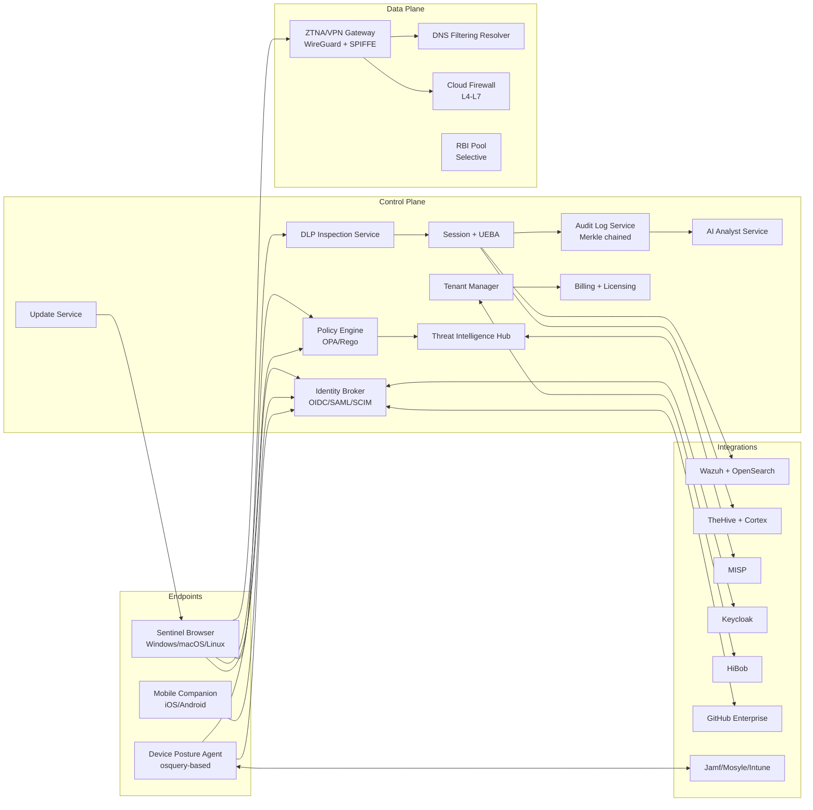
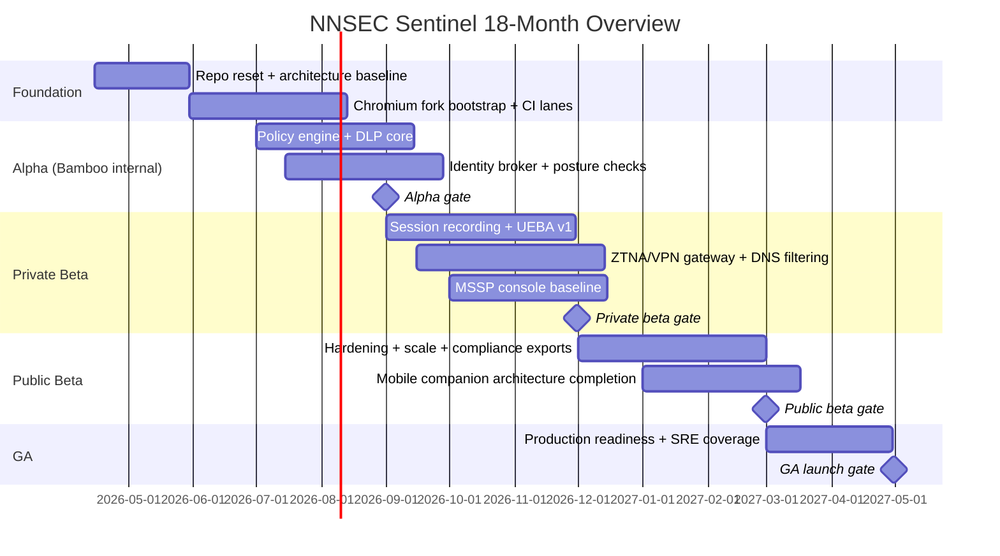

# Deliverable 1: Executive Strategy & Architecture Summary

## Scope Statement

This deliverable defines the business and technical strategy baseline for **NNSEC Sentinel** as an open-core, multi-tenant secure-browser and security-platform program. It covers market size, competitive superset analysis, initial architecture, commercialization, 18-month roadmap, budget envelope, key risks, and release gates. It is intentionally opinionated and implementation-oriented so engineering can begin immediately and auditors can trace claims to measurable targets.

---

## 1. Problem Statement

Regulated organizations are still securing work through a fragmented stack (VPN + SWG + CASB + endpoint agent + password manager + DLP + UEBA + SIEM integrations), while user activity increasingly concentrates in browser sessions. This creates high control overlap, weak policy consistency, and delayed incident response.

### 1.1 Current Security and Cost Friction

| Pain Area | Typical Current State (Bamboo-like fintechs) | Operational Consequence | Sentinel v1 Target |
|---|---|---|---|
| Browser trust boundary | Commodity browser + multiple extensions | Control bypass and policy drift | Forked Chromium with enforced controls |
| Tool sprawl | 6-12 overlapping products | Higher TCO, fragmented ownership | Consolidate to 1 platform + selective integrations |
| DLP latency | Multiple inline engines, often >150ms | User friction and workarounds | `<50ms` p95 synchronous policy decision |
| Incident reconstruction | Partial logs, no session replay | Slow triage, higher MTTR | Searchable session + policy event linkage |
| BYOD posture | Inconsistent checks across OS types | Access granted without reliable attestation | Posture-gated access with attestation tiering |
| Audit evidence | Manual exports and spreadsheets | High compliance labor and audit risk | Continuous evidence collection and export APIs |

### 1.2 Industry Data Baseline (Conceptual Source Set)

| Data Point | Signal | Planning Interpretation |
|---|---|---|
| Gartner SSE and SASE guidance (2024-2025 research stream) | Browser and identity-centric controls are displacing network-only approaches | Browser-native control plane is strategically aligned |
| Verizon DBIR trends (credential abuse + web app vectors) | Credential theft and session hijack remain top initial access vectors | Password/passkey and session controls are first-order requirements |
| IBM Cost of Data Breach benchmarks | Higher breach cost in regulated sectors; detection and response speed is key cost driver | Session-level telemetry and AI-assisted triage reduce loss exposure |
| CISA and ENISA advisories on phishing and infostealers | Browser-mediated attacks are persistent and adaptive | In-browser anti-phishing and prompt inspection are required |
| PCI DSS v4.0 custom control flexibility | Explicit control evidence quality expectations increased | Product must produce control-level artifacts, not only logs |

### 1.3 Why Build Now

1. Bamboo Card already has key integration assets (Wazuh, TheHive, Cortex, MISP, Keycloak), reducing platform bootstrap risk.
2. NNSEC has a natural MSSP channel and certification arm (GACA) to accelerate first customers.
3. Competitors are either browser-only, network-only, or SaaS-bundled with limited deployment flexibility.
4. Chromium governance is difficult but tractable for a focused, senior team with disciplined patch strategy.

---

## 2. Market Analysis

## 2.1 TAM / SAM / SOM Model

### Method

- **TAM**: Global enterprise spend attributable to secure browser + SSE/SASE + DLP + insider-risk adjacent categories that Sentinel consolidates.
- **SAM**: Serviceable market in targeted segments: regulated mid-market/enterprise, fintech, and MSSP channel where multi-tenant white-label is actionable.
- **SOM (18 months)**: Realistic capture through Bamboo anchor + NNSEC direct and partner motions.

| Metric | Assumption Set | 2026 Estimate (USD) |
|---|---|---|
| TAM | Global browser security + SSE/SASE + enterprise DLP budget slices addressable by consolidation | `$35B-$50B` |
| SAM | Geographies and sectors reachable by NNSEC/Bamboo network, product maturity v1-v2, compliance fit | `$1.2B-$2.0B` |
| SOM (18 months) | 8-20 paying orgs, 5k-40k seats blended ACV by tier | `$6M-$18M ARR` |

### SOM Build-Up Scenario

| Segment | Customers (18 mo) | Avg Seats | ARR per Customer | ARR Range |
|---|---|---:|---:|---:|
| Design-partner enterprise | 3-5 | 1,500 | $180k-$450k | $0.5M-$2.2M |
| Regulated mid-market | 4-10 | 800 | $90k-$240k | $0.4M-$2.4M |
| MSSP tenant bundles | 1-5 partners | 3,000 downstream | $300k-$1.2M | $0.3M-$6.0M |
| **Total** | 8-20 | - | - | **$1.2M-$10.6M (conservative)** / **$6M-$18M (targeted)** |

## 2.2 Competitive Deep-Dive (12 Products, 25 Dimensions)

Legend: **F** full capability, **P** partial capability, **N** none/native gap, **T** target state for Sentinel.

Products:
- **PA** Palo Alto Prisma Access Browser
- **IS** Island
- **SF** Surf Security
- **GC** Google Chrome Enterprise Premium
- **ME** Microsoft Edge for Business
- **SE** Seraphic
- **LX** LayerX
- **MN** Menlo Security
- **PP** Perception Point Web Security
- **NL** NordLayer
- **ZS** Zscaler (ZIA/ZPA/CASB)
- **CF** Cloudflare One
- **SN** NNSEC Sentinel target

| # | Capability Dimension | PA | IS | SF | GC | ME | SE | LX | MN | PP | NL | ZS | CF | SN |
|---:|---|---|---|---|---|---|---|---|---|---|---|---|---|---|
| 1 | Chromium fork control depth | F | F | F | P | P | N | N | N | N | N | N | N | **T(F)** |
| 2 | Extension-companion mode | P | P | P | P | P | F | F | N | P | N | P | P | **T(F)** |
| 3 | Per-app policy granularity | F | F | F | P | P | P | P | P | P | P | F | F | **T(F)** |
| 4 | Screenshot prevention | F | F | P | P | P | P | P | P | N | N | P | P | **T(F)** |
| 5 | Clipboard controls | F | F | P | P | P | P | F | P | N | N | P | P | **T(F)** |
| 6 | Dynamic watermarking | F | F | P | P | P | N | P | P | N | N | P | P | **T(F)** |
| 7 | Session recording | F | F | P | N | N | N | P | P | N | N | P | P | **T(F)** |
| 8 | Regex-based DLP | F | F | F | F | F | P | F | P | P | P | F | F | **T(F)** |
| 9 | Exact Data Matching (EDM) | P | P | P | P | P | N | P | N | N | N | F | F | **T(F)** |
| 10 | Document fingerprinting | P | P | P | P | P | N | P | N | N | N | F | F | **T(F)** |
| 11 | OCR for image DLP | P | P | P | N | N | N | P | P | P | N | F | F | **T(F)** |
| 12 | GenAI prompt inspection | F | P | F | P | P | P | F | P | P | N | P | P | **T(F)** |
| 13 | RBI fallback | F | P | P | N | N | N | N | F | P | N | F | F | **T(F selective)** |
| 14 | SWG URL filtering | F | P | P | P | P | N | P | F | F | F | F | F | **T(F)** |
| 15 | CASB shadow IT | F | P | F | P | P | P | F | F | P | P | F | F | **T(F)** |
| 16 | ZTNA app access | F | P | P | N | N | N | N | P | N | F | F | F | **T(F)** |
| 17 | WireGuard-grade VPN | N | N | N | N | N | N | N | N | N | F | P | P | **T(F)** |
| 18 | Dedicated customer gateways | P | N | N | N | N | N | N | P | N | F | F | F | **T(F)** |
| 19 | Dedicated static IP | P | N | N | N | N | N | N | P | N | F | F | F | **T(F)** |
| 20 | DNS filtering resolver | F | P | P | P | P | N | P | F | P | F | F | F | **T(F)** |
| 21 | Enterprise password vault | N | P | N | P | P | N | N | N | N | N | N | N | **T(F)** |
| 22 | SCIM + JIT lifecycle | F | F | F | F | F | P | P | P | P | P | F | F | **T(F)** |
| 23 | Device posture attestation | F | P | F | P | F | P | P | P | N | P | F | F | **T(F)** |
| 24 | UEBA / insider-risk scoring | P | P | P | P | P | P | P | P | P | N | F | P | **T(F)** |
| 25 | MSSP-native multi-tenancy | P | P | P | P | P | P | P | P | P | P | P | P | **T(F day 1)** |

### Competitive Positioning Summary

- No single competitor combines **native fork control depth + ZTNA/VPN + password vault + compliance evidence + MSSP-first tenancy** in one product family.
- Sentinel risk is not feature imagination, it is execution cadence and quality on Chromium and distributed infrastructure.

## 2.3 Build vs Buy vs Integrate (Strategic Components)

| Capability | Build | Buy | Integrate | Decision | Rationale |
|---|---|---|---|---|---|
| Browser core controls | High effort | Not practical | Chromium upstream baseline | **Build + upstream integrate** | Core moat; cannot outsource security boundary |
| Identity & SSO | Medium | Commercial IdP broker possible | Keycloak, Okta, Entra | **Integrate-first** | Faster compliance and federation maturity |
| Threat intel | Medium | Premium feeds expensive | MISP/OpenCTI + selective paid feeds | **Integrate + normalize** | Balanced cost and depth |
| Malware detonation | High | Managed sandbox APIs available | CAPE/Cuckoo | **Hybrid** | Start open-source; add paid detonation if needed |
| Password vault crypto core | High | White-label SDK possible | 1Password migration bridge | **Build with narrow v1** | Strategic but scope-limited in v1 |
| RBI | High | Menlo-style full stack costly | Kasm/Neko primitives | **Selective integrate/build** | Use as policy fallback, not universal path |
| Billing | Low | Stripe mature | Stripe + internal ledger | **Integrate** | Commodity domain, avoid bespoke complexity |

---

## 3. Product Positioning and ICP

## 3.1 Positioning Statement

**NNSEC Sentinel** is the browser-native zero-trust control plane for regulated organizations that need enforceable policy on unmanaged and managed devices without stacking multiple disjoint security products.

## 3.2 ICP Definition

| ICP Tier | Profile | Core Pain | Required Controls | Buying Motion |
|---|---|---|---|---|
| Primary | Regulated fintech and payment orgs (200-5,000 employees) | PCI scope expansion, contractor/BYOD risk, audit burden | DLP, session recording, device posture, compliance evidence | CISO + Head of Compliance + IT Ops |
| Secondary | MSSPs serving SMB-midmarket regulated clients | Tool fragmentation across tenants, low analyst leverage | Multi-tenant management, white-labeling, policy templates | Partner program + channel sales |
| Tertiary | Dev-centric tech firms with mixed endpoints | Source code/data exfiltration via browser/GenAI tools | Fine-grained browser DLP and policy-as-code | Security engineering + platform |

## 3.3 Enterprise Requirements Definition

Sentinel defines "enterprise-grade" as:
1. SSO federation + SCIM + role delegation
2. Multi-region HA with explicit RPO/RTO and tested failover
3. Evidence-grade immutable logging
4. Formal release channels and rollback
5. Control-level compliance mapping exports
6. Tenant isolation with blast-radius limits
7. Performance SLOs with p95/p99 budgets
8. Auditable policy lifecycle with approvals and rollback history

---

## 4. High-Level Architecture

### 4.1 Initial Performance Budgets (v1)

| Flow | Target |
|---|---|
| Policy fetch after login | `<200ms` p95 within same region |
| Synchronous DLP decision | `<50ms` p95, `<120ms` p99 |
| URL threat verdict lookup | `<30ms` p95 (hot cache) |
| Session event ingest | 20k events/sec per ingest shard |
| Gateway throughput | 1 Gbps per user target on enterprise profile (regional variance noted) |
| Browser cold-start regression vs stock Chromium | `<=15%` |

## 4.2 Inline ADR Set (Major Decisions)

### ADR-001: Native Chromium Fork vs Extension-Only
- **Context**: Need hard controls (screenshot, clipboard, download, rendering path awareness) that extensions cannot fully enforce.
- **Options considered**: (1) Extension-only, (2) Managed stock Chromium, (3) Forked Chromium + optional extension companion.
- **Decision**: Adopt **forked Chromium core** with extension companion mode for non-managed edge cases.
- **Consequences**:
  - Positive: deep control surface, differentiated enforcement capability.
  - Negative: heavy maintenance burden and upstream merge discipline required.
  - Neutral: requires dedicated Chromium expertise and CI cost.
- **Alternatives rejected**:
  - Extension-only rejected because privileged events and anti-tamper guarantees are incomplete.
  - Stock-managed browser rejected because core telemetry and policy hooks are constrained by vendor ecosystems.
- **Revisit trigger**: If Chromium patch delta exceeds 2x planned maintenance cost for two consecutive quarters.

### ADR-002: MSSP Multi-Tenancy from Day One
- **Context**: NNSEC go-to-market includes direct MSSP resale and white-label operations.
- **Options considered**: (1) Single tenant v1 then migrate, (2) Multi-tenant logical isolation, (3) Separate stacks per tenant.
- **Decision**: **Logical multi-tenancy v1** with strong RLS and tenant-scoped keys, optional dedicated stacks for Enterprise.
- **Consequences**:
  - Positive: aligns product with channel motion from first release.
  - Negative: authorization and data-isolation complexity increases.
  - Neutral: requires strict tenancy testing harness.
- **Alternatives rejected**:
  - Single-tenant-first rejected due re-architecture risk and partner misfit.
  - Fully separate stack per tenant rejected due cost and operations inefficiency at early stage.
- **Revisit trigger**: If regulated design partners require dedicated infrastructure as default procurement condition.

### ADR-003: OPA/Rego as Policy Runtime
- **Context**: Need deterministic, testable, explainable policy evaluation with low latency.
- **Options considered**: (1) OPA/Rego, (2) AWS Cedar, (3) Custom DSL engine.
- **Decision**: **OPA/Rego primary**, Cedar adapter evaluated for AWS-heavy tenants.
- **Consequences**:
  - Positive: mature ecosystem and strong policy-as-code fit.
  - Negative: learning curve for non-engineering policy authors.
  - Neutral: requires policy tooling and lint pipeline.
- **Alternatives rejected**:
  - Cedar rejected for primary due narrower operational familiarity outside AWS-first teams.
  - Custom engine rejected due verification and maintenance burden.
- **Revisit trigger**: If policy authoring friction remains high after NL-to-policy compiler and GUI authoring in beta.

### ADR-004: Hybrid PoP Strategy (AWS Global Accelerator + selective regional PoPs)
- **Context**: Need global reach without hyperscale edge-network burn.
- **Options considered**: (1) Build full private PoP mesh early, (2) Cloud-only regions, (3) Hybrid accelerator + strategic PoPs.
- **Decision**: **Hybrid model** with staged PoP expansion based on customer concentration.
- **Consequences**:
  - Positive: faster launch and lower capex.
  - Negative: some geographies may have latency variance pre-expansion.
  - Neutral: operations playbook must support mixed topology.
- **Alternatives rejected**:
  - Full private mesh rejected due excessive early capex and staffing requirements.
  - Cloud-only rejected for long-term egress cost and dedicated-IP expectations.
- **Revisit trigger**: If >25% traffic experiences >80ms RTT above target for two consecutive months.

### ADR-005: Open-Core Licensing Model
- **Context**: Need developer trust, faster adoption, and commercial defensibility.
- **Options considered**: (1) Fully closed source, (2) Fully open source, (3) Open-core split.
- **Decision**: **Open-core** (community security baseline + commercial enterprise modules).
- **Consequences**:
  - Positive: improves adoption and transparency while preserving monetizable features.
  - Negative: licensing boundary governance required.
  - Neutral: demands legal process for contribution and dependency auditing.
- **Alternatives rejected**:
  - Fully closed rejected due slower ecosystem growth and reduced trust with security buyers.
  - Fully open rejected due limited margin on advanced enterprise capabilities.
- **Revisit trigger**: If conversion from community to paid remains below target for 3 release cycles.

---

## 5. Commercial Model (Open-Core, Tiers, MSSP)

## 5.1 Packaging Strategy

| Tier | Target Buyer | Indicative Price | Core Inclusions | Exclusions |
|---|---|---:|---|---|
| Community | Security engineering teams | Free | Core browser controls, baseline policy, local telemetry | No multi-tenant SaaS control plane, no premium compliance exports |
| Team | SMB security admins | `$12-$18` / user / month | Managed policy, basic DLP, SSO | Limited session recording retention, no advanced UEBA |
| Business | Mid-market regulated | `$25-$40` / user / month | Advanced DLP, session recording, threat intel hub, API access | No dedicated infrastructure default |
| Enterprise | Regulated enterprise | `$45-$75` / user / month + platform fee | Dedicated gateways, static IP, advanced compliance pack, premium support | - |
| MSSP | Service providers | Volume + tenant bundle pricing | White-label console, cross-tenant operations, delegated RBAC, billing APIs | - |

## 5.2 Open-Core Split (Initial)

| Open-Core (AGPL candidate) | Commercial (EULA) |
|---|---|
| Browser baseline policy hooks | Multi-tenant control plane |
| Policy evaluation runtime integration | Advanced DLP (EDM/fingerprint/OCR tuned packs) |
| Basic telemetry agent + API contracts | Session replay at scale + UEBA models |
| Local developer mode + test harness | MSSP white-label + advanced compliance workspace |
| Documentation and starter policies | AI Analyst assistant + premium threat feeds |

---

## 6. 18-Month Roadmap Overview

### 6.1 Quarter-Level Outcomes

| Quarter | Engineering Outcome | Commercial Outcome |
|---|---|---|
| Q2 2026 | Architecture locked, core services scaffolded | Design-partner requirements frozen |
| Q3 2026 | Internal alpha with Bamboo users | Security and compliance trial evidence generated |
| Q4 2026 | Private beta with 3-5 organizations | Early ARR and channel validation |
| Q1 2027 | Public beta, reliability hardening | Pipeline conversion and support model tested |
| Q2 2027 | GA, v1.0 controls and integrations stabilized | Enterprise and MSSP expansion |

---

## 7. Financial Model (Headcount, OpEx, CapEx)

All values are planning ranges in USD.

| Quarter | Team Size (Approx) | Primary Hiring Mix | OpEx / Month | CapEx / Quarter | Cost Drivers |
|---|---:|---|---:|---:|---|
| Q2 2026 | 2-3 | Chromium + backend | $70k-$120k | $40k-$80k | Build infra, signing certs, core cloud |
| Q3 2026 | 4-6 | +frontend +DevSecOps | $120k-$190k | $60k-$120k | CI scale, security tooling, test devices |
| Q4 2026 | 7-9 | +mobile +SRE seed | $170k-$260k | $80k-$180k | Multi-region env, observability, PoP pilots |
| Q1 2027 | 9-11 | +platform/ML | $220k-$320k | $100k-$220k | Production hardening, support readiness |
| Q2 2027 | 10-12 | +support and partner enablement | $250k-$360k | $120k-$250k | Scale infra, compliance audits, partner ops |

### 7.1 Unit Economics Guardrails

| Metric | Target |
|---|---|
| Gross margin (steady state) | `>=70%` |
| Infrastructure COGS per active user / month | `<$6` at 10k seats |
| Support + success COGS per enterprise customer | `<15%` of ACV |
| Payback target (blended) | `<18 months` |

---

## 8. Top 10 Risks (LxI, Mitigation, Residual, Owner)

Scale: Likelihood (L) 1-5, Impact (I) 1-5.

| # | Risk | L | I | Mitigation (Technical + Procedural) | Residual Risk | Owner Role |
|---:|---|---:|---:|---|---|---|
| 1 | Chromium patch maintenance overload | 4 | 5 | Patch-budget discipline, upstream sync cadence, automated conflict tests | Medium-High | Browser Platform Lead |
| 2 | DLP false positives degrade user adoption | 4 | 4 | Layered detection tuning, shadow mode, human feedback loops | Medium | Product Security Lead |
| 3 | Tenant isolation bug causing cross-tenant data exposure | 2 | 5 | RLS proofs, tenancy fuzz tests, mandatory code-owner review | Medium | Backend Architect |
| 4 | Gateway throughput misses 1Gbps target in some regions | 3 | 4 | eBPF tuning, regional benchmarking, dedicated PoP expansion triggers | Medium | Network Platform Lead |
| 5 | Compliance mapping gaps discovered during audit | 3 | 5 | Control-evidence matrix automation, pre-audit drills, QSA checkpoints | Medium | Compliance Architect |
| 6 | iOS/Android platform limits reduce parity promises | 4 | 3 | Honest feature flags, MDM-based compensating controls, roadmap transparency | Medium | Mobile Security Lead |
| 7 | Threat-feed quality variance and legal ingestion constraints | 3 | 3 | Multi-feed scoring, legal review of crawlers, confidence weighting | Low-Medium | Threat Intel Lead |
| 8 | Customer pushback on session recording privacy | 3 | 4 | Privacy-by-default masks, scoped capture policies, legal templates | Medium | Trust & Privacy Officer |
| 9 | Hiring scarcity for Chromium specialists | 4 | 4 | Remote hiring in EU/Eastern Europe, contractor bridge plan | Medium-High | Engineering Director |
| 10 | Open-core licensing confusion | 2 | 4 | Clear module boundaries, legal review, SPDX and repo policy | Low-Medium | Product Counsel |

---

## 9. Go / No-Go Gates

| Gate | Required Evidence | Go Criteria | No-Go Trigger |
|---|---|---|---|
| Alpha (Bamboo internal) | End-to-end enrollment, policy eval, DLP actions, baseline telemetry | 200 pilot users, `<2%` crash rate, `<50ms` DLP p95 in-region | Core browser instability, policy bypass not remediated |
| Private Beta | Multi-tenant ops, design-partner onboarding, compliance evidence exports | 3-5 tenants, tenant isolation tests pass 100%, MTTR `<4h` for P1 | Cross-tenant defects, unresolved P1 security findings |
| Public Beta | Scale and support readiness | 5k active users, 99.9% control-plane SLO for 30 days | Sustained SLO miss or unresolved compliance blocker |
| GA | Security + commercial readiness | External pen-test closure rate `>=95%` high/critical, support/on-call staffed | Critical exploit unresolved, operational readiness gap |

---

## 10. Assumptions & Open Questions

## 10.1 Assumptions

1. AWS remains the primary hosting platform with multi-account controls.
2. Enterprise-grade Anthropic API access is available for NL-to-policy and analyst functions.
3. Bamboo Card remains design partner with access to representative workloads.
4. Keycloak remains the default identity broker anchor.
5. Legal and compliance review cycles can run in parallel with engineering.

## 10.2 Open Questions

1. Which geographic regions must be in-scope for data residency by GA (UAE-only vs UAE+EU)?
2. Is 1Password migration required at launch or only interoperability bridge mode?
3. What is the initial legal position on blockchain anchoring for audit logs by customer segment?
4. Which MSSP pricing construct is preferred first: seat-based wholesale or platform minimum + usage?
5. What exact minimum mobile control parity is contractual for beta customers?

---

**Deliverable 1 of 15 complete. Ready for Deliverable 2 — proceed?**
