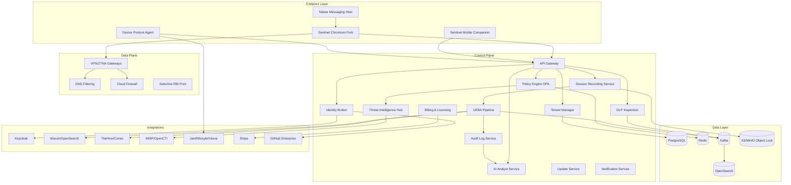
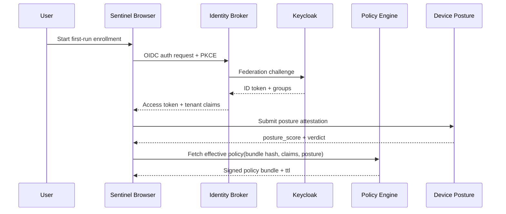
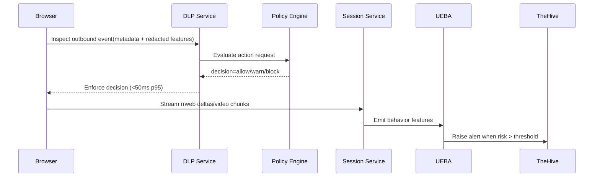
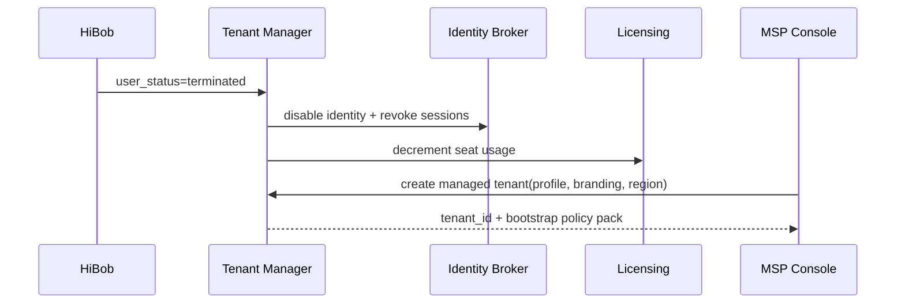
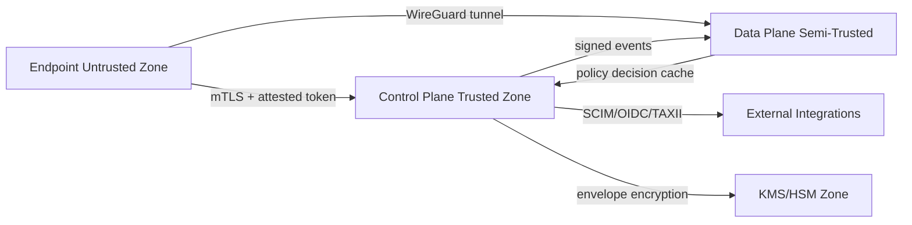

# Deliverable 2: System Architecture Document (SAD)

## Scope Statement

This document defines the full system architecture for NNSEC Sentinel across control plane, data plane, endpoint components, identity flows, cloud/on-prem topologies, trust boundaries, and resilience posture. It is implementation-facing and includes formal sequence diagrams, STRIDE threats, and architecture decision records (ADRs) for the top 15 decisions.

## 1. Full Component Architecture

## 2. Sequence Diagrams

### 2.1 Enrollment + Login + Policy Fetch

### 2.2 DLP Decision + Session Record + Breach Response

### 2.3 Offboarding + Tenant Provisioning + MSP Onboarding

## 3. Data Flow and Trust Boundaries

| Data Class | Examples | Boundary Rule |
|---|---|---|
| Public | product metadata, docs | No sensitive handling required |
| Internal | operational metrics | mTLS in transit, 30-day retention |
| Confidential | user identity, SaaS inventory | tenant-scoped encryption + RLS |
| Restricted (PCI/PII) | card-like patterns, session snippets | field-level controls + redaction + key isolation |

## 4. Deployment Topologies

### 4.1 AWS Primary

| Layer | Design |
|---|---|
| Networking | Multi-account, per-env VPC, private subnets for services, public ALB only for ingress edge |
| Compute | EKS for services, managed node groups, Bottlerocket AMIs for gateway nodes |
| Data | RDS PostgreSQL Multi-AZ, MSK for Kafka, OpenSearch, S3 object lock |
| Edge | AWS Global Accelerator + regional gateway pools |
| Security | AWS WAF + Shield + GuardDuty + IAM Identity Center |

### 4.2 Azure and GCP Variants

| Cloud | Equivalents |
|---|---|
| Azure | AKS, PostgreSQL Flexible Server, Event Hubs/Kafka-compatible, Front Door, Key Vault |
| GCP | GKE, Cloud SQL, Pub/Sub + Kafka bridge, Cloud Armor, Cloud KMS |

### 4.3 On-Prem / Air-Gapped Variant

- Kubernetes (RKE2 or OpenShift), external PostgreSQL cluster, MinIO object lock, Kafka (KRaft), OpenSearch.
- Offline licensing uses Ed25519-signed time-bounded token bundle.
- Update channels via mirrored artifact repository with signed bundles only.

## 5. Multi-Region Active-Active and DR

| Service | RPO | RTO | HA Strategy |
|---|---:|---:|---|
| Identity Broker | 1 min | 15 min | Active-active, token signing key replication |
| Policy Engine | 0-1 min | 5 min | Stateless horizontal scale + redis warm cache |
| DLP Service | 1 min | 10 min | Regional shards + queue replay |
| Session Recording | 5 min | 30 min | Cross-region object replication |
| Audit Log Service | 0 min logical | 15 min | Merkle chain replication with sequence checkpoints |
| Gateway/ZTNA | near-0 | 5 min | Anycast failover and regional draining |

## 6. Port and Protocol Matrix

| Source | Destination | Port | Protocol | Purpose |
|---|---|---:|---|---|
| Browser | API Gateway | 443 | HTTPS/mTLS optional | control-plane API |
| Browser | Gateway | 51820 | WireGuard/UDP | secure tunnel |
| Services | OPA sidecar | 8181 | HTTP local | policy queries |
| Services | PostgreSQL | 5432 | TLS | transactional storage |
| Services | Kafka | 9093 | TLS/SASL | event stream |
| Services | OpenSearch | 9200 | TLS | search and SIEM |
| Services | MinIO/S3 | 443 | HTTPS | recording storage |
| Integrations | Keycloak | 443 | OIDC/SAML | federation |
| Integrations | MISP | 443 | TAXII/STIX | threat intel ingest |

## 7. Identity Architecture

| Area | Design |
|---|---|
| Federation | OIDC primary, SAML fallback, Keycloak as broker |
| Provisioning | SCIM 2.0 with JIT fallback |
| Token lifecycle | access token 15 min, refresh token 8h, tenant policy TTL 5 min |
| Key rotation | signing keys every 30 days; emergency rotation <1h |
| Device posture | bound to token claims via attestation hash |
| Session revocation | near-real-time deny list propagated through Redis/Kafka |

## 8. STRIDE Threat Model (30 Threats)

| # | Surface | STRIDE | Threat | Mitigation | Detection | Recovery |
|---:|---|---|---|---|---|---|
| 1 | OIDC callback | Spoofing | token substitution | PKCE + nonce + audience checks | auth anomaly alerts | revoke keys/sessions |
| 2 | SCIM API | Tampering | unauthorized role map | signed SCIM connector credentials | drift monitor | rollback SCIM batch |
| 3 | Browser policy cache | Repudiation | user denies action source | signed event chain | audit verifier | replay chain |
| 4 | DLP pipeline | Info Disclosure | sensitive payload logged | no raw content logging policy | DLP telemetry lint | purge + postmortem |
| 5 | Gateway node | DoS | tunnel flood | per-tenant rate limit + autoscale | node saturation alert | failover region |
| 6 | API gateway | Elevation | authz bypass | OPA deny-by-default | authz mismatch logs | hotfix policy |
| 7 | Session storage | Tampering | recording mutation | object lock + hash chain | integrity check jobs | restore immutable copy |
| 8 | Threat feed ingest | Tampering | poisoned feed | signed feed validation + scoring | outlier detector | quarantine feed |
| 9 | Admin console | Spoofing | phishing admin session | WebAuthn required for admins | impossible travel | session revoke |
| 10 | Tenant manager | Info Disclosure | cross-tenant query | RLS + tenant context enforcement | query audit | emergency isolation |
| 11 | Password vault | Info Disclosure | key derivation weakness | Argon2id, strong params | crypto config drift | force re-enroll |
| 12 | Policy compiler | Tampering | NL prompt injection | constrained schema + static checks | compile diff checks | rollback policy bundle |
| 13 | Update service | Spoofing | malicious update | TUF-style metadata + signature verify | signature failures | kill-switch rollback |
| 14 | Native host | Elevation | privilege misuse | code signing + strict IPC ACL | host audit logs | disable host |
| 15 | Mobile app | Repudiation | bypassed capture controls | attestation + MDM policy | posture mismatch | block sensitive apps |
| 16 | Kafka stream | DoS | event backlog growth | partition scaling + quotas | consumer lag alerts | backpressure mode |
| 17 | OpenSearch | Info Disclosure | broad query leakage | field-level security | access anomalies | rotate creds |
| 18 | DNS resolver | Spoofing | DNS response poisoning | DNSSEC validation | mismatch telemetry | cache purge |
| 19 | Cloud firewall | Tampering | rules overwritten | signed policy commits | rule drift alerts | reapply last good |
| 20 | SIEM integration | Repudiation | dropped alerts | signed webhook receipts | heartbeat monitors | replay queue |
| 21 | Billing API | Tampering | meter manipulation | append-only usage ledger | reconciliation jobs | recompute invoices |
| 22 | License token | Spoofing | forged offline token | Ed25519 verification | invalid signature alerts | revoke tenant license |
| 23 | AI analyst | Info Disclosure | prompt data over-sharing | data minimization + redaction | prompt audit | block tool scope |
| 24 | RBI pool | Elevation | breakout exploit | hardened sandbox + seccomp | runtime IDS | rotate pool images |
| 25 | Device posture | Spoofing | fake attestation | TPM/SE check + challenge | attestation failures | quarantine device |
| 26 | Browser extension store | Tampering | malicious CRX | signed CRX allowlist only | extension integrity scan | remote disable |
| 27 | Notification service | Spoofing | fake incident mail | DKIM/SPF/DMARC + signed templates | deliverability alerts | rotate API keys |
| 28 | Key management | Elevation | over-privileged KMS roles | least privilege + breakglass workflow | IAM analyzer | revoke role |
| 29 | On-prem mirror | Tampering | stale package sync | signed manifest verification | mirror freshness checks | rollback bundle |
| 30 | Support tooling | Info Disclosure | engineer access overreach | JIT access + session recording | access review | credential reset |

## 9. ADR Set (Top 15)

Each ADR includes context, options, decision, consequences, rejected alternatives, and revisit triggers.

| ADR | Decision | Revisit Trigger |
|---|---|---|
| ADR-01 | Chromium fork + extension companion | patch burden exceeds budget for 2 quarters |
| ADR-02 | OPA/Rego as runtime policy engine | policy latency >10ms p95 sustained |
| ADR-03 | Keycloak-first identity broker | federation failure rate >0.5% p95 |
| ADR-04 | Row-level multi-tenancy with tenant keys | regulatory requirement for mandatory dedicated stacks |
| ADR-05 | Kafka backbone for eventing | cost or ops burden >25% over budget |
| ADR-06 | OpenSearch primary analytics store | query p95 >2s for critical workflows |
| ADR-07 | Hybrid PoP strategy | >25% users above RTT SLO for 60 days |
| ADR-08 | WireGuard for tunnel protocol | mobile/enterprise incompatibility unresolved |
| ADR-09 | Selective RBI fallback | exploit trends require full isolation by default |
| ADR-10 | MinIO/S3 object lock for recordings | legal hold integrity gaps |
| ADR-11 | Claude-assisted NL compiler with guardrails | policy miscompile rate >1% |
| ADR-12 | Stripe billing + internal usage ledger | enterprise billing custom terms dominate roadmap |
| ADR-13 | SLSA L3 supply-chain goal | release signing incidents occur |
| ADR-14 | Redis for policy cache and revocation fanout | stale policy incidents >0.1% |
| ADR-15 | Multi-cloud reference architecture from v1 | one cloud reaches >90% customer footprint |

### ADR Detail Template Applied (example: ADR-04)

- **Context**: Sentinel requires day-one MSSP multi-tenancy with auditable isolation and cost efficiency.
- **Options considered**: schema-per-tenant, row-level security (RLS), dedicated stack per tenant.
- **Decision**: use RLS + tenant-scoped encryption keys; dedicated stack optional enterprise add-on.
- **Consequences**: positive: operational scale and lower cost; negative: strict authorization testing needed; neutral: more complex migration logic.
- **Alternatives rejected**:
  - schema-per-tenant rejected due migration sprawl and schema drift risk.
  - dedicated-stack-only rejected due high fixed infrastructure cost at early stage.
- **Revisit trigger**: mandatory residency/isolation contracts requiring physical isolation.

## 10. Assumptions & Open Questions

### Assumptions
1. EKS-managed Kubernetes is acceptable for production control plane in v1.
2. Tenant isolation can be validated with automated adversarial tests in CI.
3. Regional PoP expansion follows commercial traction.

### Open Questions
1. Which geographies require sovereign cloud first?
2. What is the strict contractual RTO target for Bamboo vs external customers?
3. Should dedicated stack become default for GACA-certified tier?

**Deliverable 2 of 15 complete. Ready for Deliverable 3 — proceed?**
