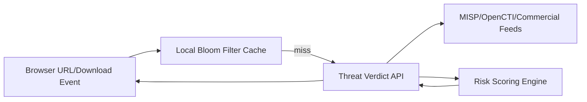

# Deliverable 3: Chromium Fork Engineering Plan

## Scope Statement

This document defines how Sentinel maintains a Chromium fork across desktop and mobile channels with reproducible builds, secure update delivery, telemetry replacement, signing/notarization, and explicit performance budgets.

## 1. Upstream Strategy

| Item | Decision |
|---|---|
| Base channel | Chromium stable branch, weekly security patch pull |
| Merge model | Rebase fork branch onto upstream stable tags; hotfix branch for zero-days |
| Upstream-first policy | Generic fixes contributed upstream when not Sentinel-specific |
| Security SLA | critical Chromium CVEs patched and released within 72 hours |

### ADR-03-01: Stable-track Forking
- **Context**: balancing exploit response with patch complexity.
- **Options**: stable only, beta lead, ESR-like freeze.
- **Decision**: stable + rapid security cherry-pick.
- **Consequences**: manageable churn, near-current security posture, moderate patch conflict.
- **Rejected**: beta lead rejected due instability; long freeze rejected due vulnerability exposure.
- **Revisit trigger**: if median conflict count >30 files per rebase cycle.

## 2. Build Toolchain and Platform Matrix

| Platform | Toolchain | Artifact |
|---|---|---|
| macOS x64/arm64 | `depot_tools`, GN, ninja, Xcode 16 SDK | `.app` + `.pkg` |
| Windows x64 | Visual Studio 2022 Build Tools, GN, ninja | `.exe` + `.msi` |
| Linux x64/arm64 | clang/lld, GN, ninja | `.deb`, `.rpm`, AppImage |
| Android | Chromium Android GN build, Gradle wrappers | `.aab` |
| iOS | WKWebView wrapper shell + native controls | `.ipa` |

## 3. Reproducible Builds and Supply Chain

- SLSA L3 target with provenance attestations generated in CI.
- Hermetic build containers per platform lane.
- Deterministic build flags and pinned dependency revisions.
- Artifact signing and digest verification prior to channel promotion.

### Measurement Plan

| Metric | Target | Method |
|---|---|---|
| Rebuild drift | byte-identical or known deterministic delta | reproducibility CI job daily |
| Build provenance coverage | 100% release artifacts | cosign/sigstore attestation check |
| Dependency pinning | 100% third-party pinned by commit or checksum | policy lint in CI |

## 4. Code Signing and Distribution

| Platform | Signing Path |
|---|---|
| macOS | Apple Developer ID Application + notarization + stapling |
| Windows | EV Authenticode + timestamping |
| Linux | repository metadata signing (GPG) |
| Android | Play App Signing + Play Integrity |
| iOS | App Store distribution + device attestation controls |

## 5. Patch Management and Branching

| Branch | Purpose |
|---|---|
| `sentinel/chromium-stable` | baseline synced branch |
| `sentinel/security-hotfix/*` | CVE-specific rapid patching |
| `sentinel/feature/*` | product-specific deltas |
| `sentinel/release/*` | signed release candidates |

Conflict resolution order:
1. Security patch compatibility
2. Sandbox/integrity behavior
3. Policy enforcement hooks
4. UX branding and non-critical patches

## 6. Subsystems to Modify

| Subsystem Path | Purpose |
|---|---|
| `//chrome/browser/policy/*` | policy fetch and enforcement hooks |
| `//chrome/browser/ui/*` | work-profile UI indicators, DLP prompts |
| `//chrome/browser/download/*` | download intercept + policy gate |
| `//content/browser/*` | renderer/browser process policy checks |
| `//components/safe_browsing/*` | replace with Sentinel threat service client |
| `//components/password_manager/*` | Sentinel vault integration mode |
| `//services/network/*` | DNS policy and gateway route policy |
| `//extensions/*` | curated extension store controls |
| `//third_party/blink/renderer/*` | DOM event hooks for prompt/clipboard controls |

## 7. Rebranding Checklist

- Product name strings, icon set, startup splash, about page.
- Default homepage and policy-controlled search provider.
- User agent token `Sentinel/<version>` appended with enterprise mode flag.
- Omaha-compatible update endpoint domains replaced with Sentinel update service.

## 8. Telemetry Stripping and Replacements

| Legacy Chromium Component | Sentinel Action |
|---|---|
| Metrics Reporting | disabled by default; replaced with tenant-controlled OpenTelemetry |
| Google Update channels | replaced with Sentinel update service |
| Safe Browsing cloud calls | replaced with self-hosted threat lookup API |
| Crash reporting | redirected to self-hosted Sentry-compatible endpoint |

## 9. Safe Browsing Replacement Architecture

## 10. Extension Store Replacement

- Sentinel curated CRX repository with signed extension manifests.
- Allowlist policy can pin extension IDs and versions.
- Runtime extension integrity checks every launch and every 6 hours.

## 11. Performance Budgets

| Metric | Budget | Enforcement |
|---|---|---|
| Binary size increase vs stock Chromium | `<=20%` | CI artifact size gate |
| Cold-start regression | `<=15%` | startup benchmark suite |
| RAM regression at 10-tab workload | `<=10%` | perf lab with scripted traces |
| Policy decision overhead in renderer path | `<5ms` p95 | in-process instrumentation |

## 12. License and Attribution

- Preserve Chromium BSD notices and bundled third-party attributions.
- Automated NOTICE generation per release.
- OSS scanner gate for incompatible license introduction.

## 13. Mobile Strategy

| Platform | Strategy |
|---|---|
| Android | Chromium-based managed browser app with work-profile controls |
| iOS | WKWebView-based managed shell with network/content filter integrations; full Chromium fork not feasible on iOS |

## 14. Threat Model (STRIDE, Component-Level)

| Threat | Mitigation | Detection | Recovery |
|---|---|---|---|
| Malicious update package | signature + TUF metadata validation | signature failure alert | channel rollback |
| Renderer exploit chain | sandbox hardening + exploit heuristics | crash/anomaly correlation | emergency patch |
| Unauthorized extension sideload | signed allowlist only | extension drift event | remote disable |
| Policy bypass via local tampering | signed policy bundles + hash validation | policy checksum mismatch | force refresh |
| Data exfiltration via clipboard | per-origin clipboard policy + user prompts | exfil event stream | policy tighten |

## 15. Assumptions & Open Questions

### Assumptions
1. Dedicated Chromium specialist resources are available through remote hiring.
2. macOS notarization and Windows EV certificates are obtainable before beta.

### Open Questions
1. Is enterprise private extension publishing needed in private beta or GA?
2. Should LTS channel lag by 8 or 12 weeks from stable?

**Deliverable 3 of 15 complete. Ready for Deliverable 4 — proceed?**
