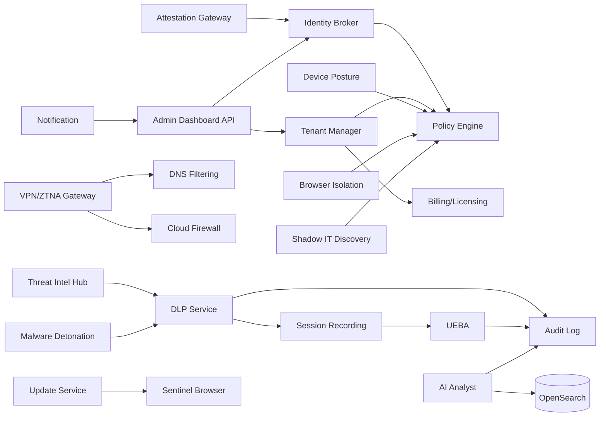

# Deliverable 5: Backend Platform Architecture

## Scope Statement

This document specifies the backend architecture for the 22 required Sentinel services, including purpose, APIs, data model anchors, scale expectations, HA/DR strategy, observability standards, and security controls.

## 1. Service Interaction Overview

## 2. Service Mini-Architecture Catalog

Legend: scale values are initial targets and are revisited quarterly.

| # | Service | Purpose / API | Data Model | Scale + HA | Security + Threat Highlights |
|---:|---|---|---|---|---|
| 1 | Identity Broker | OIDC/SAML/SCIM adapter. REST + OIDC endpoints. | tenant, identity, session, claim_map | 5k auth/min/region; active-active | token spoofing mitigated with PKCE, nonce, key rotation |
| 2 | Tenant Manager | Provisioning, branding, entitlements. REST/gRPC. | tenant, org_unit, branding_profile | 200 tenant ops/min; multi-AZ DB | cross-tenant tampering mitigated by RLS + signed admin actions |
| 3 | Device Posture | ingest posture facts, attestation verification. gRPC. | device, posture_snapshot, attestation | 100k devices/region; queue-backed | fake attestation mitigated via TPM/App Attest/Play Integrity checks |
| 4 | Policy Engine | OPA bundle distribution/eval. REST + bundle API. | policy_bundle, assignment, decision_log | <10ms p95 eval; stateless scale | policy bypass mitigated by signed bundles + deny-by-default |
| 5 | DLP Inspection | regex/EDM/fingerprint/ML/OCR. gRPC sync + async. | classifier, match_meta, incident | 10k req/s shard; autoscale | sensitive leakage mitigated by no-raw-content logging |
| 6 | Threat Intel Hub | feed normalization STIX/TAXII. REST/TAXII. | indicator, feed_source, confidence | 2M IoCs/day ingest | feed poisoning mitigated by signature and source scoring |
| 7 | Dark Web Monitoring | breach ingestion + OSINT correlation. batch APIs. | breach_record, credential_alert | hourly ingest jobs; regional workers | legal risk mitigated by scoped crawling policy/legal review |
| 8 | RBI Service | isolated browsing fallback stream. WebRTC APIs. | isolation_session, stream_meta | 2k concurrent sessions/cluster | breakout mitigated by hardened container sandbox |
| 9 | VPN/ZTNA Gateway | identity-aware app tunnel via WireGuard. control/data APIs. | gateway, tunnel, app_route | 1Gbps/user target profile; anycast | tunnel abuse mitigated with per-identity ACL and revocation |
| 10 | Cloud Firewall | L4-L7 policy enforcement on gateways. gRPC control plane. | firewall_rule, policy_version | line-rate with eBPF, HA pair | rules tampering mitigated by signed policy commits |
| 11 | DNS Filtering | DoH/DoT resolver + policy engine. DNS APIs. | domain_rule, resolver_event | 100k qps/cluster | DNS poisoning mitigated with DNSSEC validation |
| 12 | Password Vault | E2EE credentials/passkeys. REST sync API. | vault_item, vault_key_ref, share | 10k sync ops/min | key disclosure mitigated by Argon2id + client-side encryption |
| 13 | Session Recording | rrweb/video ingest + immutable storage. ingest API. | session, chunk, redaction_mask | 5k concurrent record streams | tampering mitigated by object lock + hash chain |
| 14 | UEBA Analytics | streaming anomaly scoring (Flink). internal APIs. | behavior_feature, risk_score, baseline | 50k events/sec pipeline | model poisoning mitigated with feature validation |
| 15 | Audit Log | append-only, merkle-chained. REST query/proof API. | audit_event, merkle_root, anchor | 20k writes/sec; cross-region replicate | repudiation mitigated with signed events and proofs |
| 16 | AI Analyst | Claude + RAG + tool-use orchestration. chat API. | investigation, prompt_trace, action_plan | 200 concurrent investigations | prompt injection mitigated via tool allowlist and redaction |
| 17 | Update Service | channel mgmt + deltas + kill switch. Omaha-compatible API. | release, channel, rollout, package_sig | 5M update checks/day | malicious update blocked by signature + manifest pinning |
| 18 | Billing/Licensing | Stripe billing + usage metering + offline tokens. REST. | subscription, usage_ledger, license_token | 100k metering events/min | invoice tampering mitigated with append-only usage ledger |
| 19 | Admin Dashboard API | GraphQL primary, REST adapter. | admin_view models, role bindings | 5k admin req/s | authz bugs mitigated with RBAC + policy checks |
| 20 | Notification | email/slack/teams/webhook/pagerduty dispatch. | notification_rule, dispatch_log | 1M notifications/day | spoofing mitigated via signed templates + domain auth |
| 21 | Malware Detonation | CAPE/Cuckoo + static scans + triage API. | sample, verdict, behavior_report | 2k samples/hr cluster | sandbox escape mitigated by hardened isolated worker nodes |
| 22 | Shadow IT Discovery | SaaS catalog, OAuth inventory, risk scoring. REST. | saas_app, oauth_grant, risk_score | 50k events/min parse | OAuth abuse mitigated by grant scope monitoring/revocation |
| 23 | Attestation Gateway | pre-IdP mTLS + attestation verification. REST endpoint for IdP fronting. | device_key, nonce_cache, attestation_decision | 10k auth checks/min/instance; horizontally scalable | browser spoofing/replay mitigated with Ed25519 checks + nonce cache + CIDR/UA controls |

## 3. Build-vs-Buy-vs-Integrate Analysis (Key Components)

| Service | Build | Buy | Integrate | Decision + TCO Note |
|---|---|---|---|---|
| Identity Broker | low-medium | Auth0/WorkOS | Keycloak | Integrate Keycloak; lower recurring cost |
| DLP Engine | high | Nightfall/Forcepoint | open models + OCR libs | Build core for differentiation; buy optional premium detectors |
| RBI | high | Menlo/API | Kasm/Neko | selective integrate first to control cost |
| UEBA | medium-high | Exabeam/Securonix | Flink + custom models | build incremental due custom browser features |
| Billing | low | Stripe | Stripe | buy/integrate fully |
| Attestation gateway | medium | Cloudflare Access | Pomerium/custom | build core validation path; optional managed edge in geo-heavy regions |

## 4. Performance Budgets

| Service Group | p95 Latency Target | Throughput Target |
|---|---|---|
| Identity + Policy | `<200ms` login roundtrip, `<10ms` policy eval | 5k auth/min, 20k decisions/s |
| Attestation Gateway | `<25ms` added auth latency | 10k attestation checks/min/instance |
| DLP Sync Path | `<50ms` decision | 10k req/s shard |
| Session Ingest | `<150ms` chunk acceptance | 5k concurrent sessions |
| Gateway | `<20ms` added RTT regional | 1Gbps/user target profile |

## 5. Failure Mode Catalog

| Failure Mode | Detect | Recover |
|---|---|---|
| Keycloak outage | auth health checks fail | failover realm/region, cached policy grace period |
| Attestation nonce cache unavailable | replay checks degrade | fail-closed for high-risk tenants; fail-open with alert for explicitly allowed lower tiers |
| Kafka lag growth | consumer lag SLO alert | autoscale consumers + backpressure |
| DLP model timeout | inference timeout metric | fallback to regex+EDM baseline decision |
| Object storage write latency | ingest ack delay | queue + multi-part retry |
| Gateway overload | packet drop / CPU alarms | auto-scale gateway pool + redirect region |

## 6. Security Controls Baseline

- mTLS for east-west service communication.
- SPIFFE/SPIRE identities for workloads.
- Browser-bound IdP controls: mTLS client cert + signed attestation header + gateway nonce checks.
- Per-service least-privilege IAM and secret scopes.
- Centralized audit events signed at source.
- OTel tracing and security events exported to Wazuh/OpenSearch.

## 7. Assumptions & Open Questions

### Assumptions
1. Kubernetes is acceptable for both control and most data-plane microservices.
2. Managed Kafka/OpenSearch offerings are acceptable in initial regions.

### Open Questions
1. Which services require dedicated per-tenant deployment at private beta?
2. Is blockchain anchoring enabled by default for Enterprise or opt-in only?

**Deliverable 5 of 15 complete. Ready for Deliverable 6 — proceed?**
