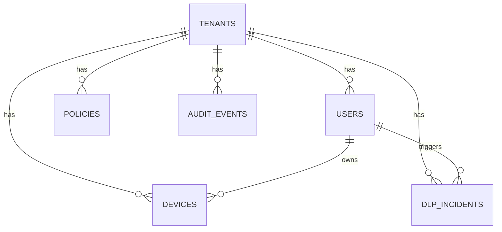

# Deliverable 6: Data Model, Schemas, and Multi-Tenancy

## Scope Statement

This document defines canonical entities, PostgreSQL schema patterns, partitioning, tenant isolation, encryption strategy, retention controls, DSR workflows, backup/restore, and migration policy.

## 1. Multi-Tenancy Decision

### ADR-06-01: Row-Level Security (RLS) Primary
- **Context**: Sentinel requires day-one MSSP multi-tenancy while preserving operational efficiency.
- **Options**: schema-per-tenant, database-per-tenant, row-level security.
- **Decision**: row-level with strict `tenant_id` propagation and policy-enforced access.
- **Consequences**: efficient operations and analytics; requires strict test coverage and query linting.
- **Rejected**: schema-per-tenant (migration burden), db-per-tenant (high fixed costs).
- **Revisit trigger**: regulated contracts requiring hard infra isolation by default.

## 2. Core DDL (PostgreSQL)

```sql
CREATE TABLE tenants (
  id UUID PRIMARY KEY,
  slug TEXT UNIQUE NOT NULL,
  name TEXT NOT NULL,
  tier TEXT NOT NULL,
  region TEXT NOT NULL,
  created_at TIMESTAMPTZ NOT NULL DEFAULT now()
);

CREATE TABLE users (
  id UUID PRIMARY KEY,
  tenant_id UUID NOT NULL REFERENCES tenants(id),
  external_subject TEXT NOT NULL,
  email TEXT NOT NULL,
  role TEXT NOT NULL,
  status TEXT NOT NULL,
  created_at TIMESTAMPTZ NOT NULL DEFAULT now(),
  UNIQUE (tenant_id, external_subject)
);

CREATE TABLE devices (
  id UUID PRIMARY KEY,
  tenant_id UUID NOT NULL REFERENCES tenants(id),
  user_id UUID REFERENCES users(id),
  platform TEXT NOT NULL,
  posture_score INT NOT NULL,
  attestation_state TEXT NOT NULL,
  last_seen_at TIMESTAMPTZ NOT NULL
);

CREATE TABLE policies (
  id UUID PRIMARY KEY,
  tenant_id UUID NOT NULL REFERENCES tenants(id),
  version INT NOT NULL,
  bundle_sha256 TEXT NOT NULL,
  state TEXT NOT NULL,
  created_by UUID REFERENCES users(id),
  created_at TIMESTAMPTZ NOT NULL DEFAULT now(),
  UNIQUE (tenant_id, version)
);

CREATE TABLE dlp_incidents (
  id UUID PRIMARY KEY,
  tenant_id UUID NOT NULL REFERENCES tenants(id),
  user_id UUID REFERENCES users(id),
  device_id UUID REFERENCES devices(id),
  action TEXT NOT NULL,
  classifier TEXT NOT NULL,
  confidence NUMERIC(5,2) NOT NULL,
  metadata JSONB NOT NULL,
  created_at TIMESTAMPTZ NOT NULL DEFAULT now()
);

CREATE TABLE audit_events (
  id BIGSERIAL PRIMARY KEY,
  tenant_id UUID NOT NULL REFERENCES tenants(id),
  actor_type TEXT NOT NULL,
  actor_id TEXT NOT NULL,
  event_type TEXT NOT NULL,
  payload JSONB NOT NULL,
  event_hash TEXT NOT NULL,
  prev_hash TEXT,
  created_at TIMESTAMPTZ NOT NULL DEFAULT now()
) PARTITION BY RANGE (created_at);
```

## 3. RLS Example

```sql
ALTER TABLE users ENABLE ROW LEVEL SECURITY;
CREATE POLICY users_tenant_isolation ON users
USING (tenant_id = current_setting('app.tenant_id')::uuid);
```

## 4. Partitioning Strategy

| Table | Strategy | Retention |
|---|---|---|
| audit_events | monthly time partitions | 13 months hot + archive |
| dlp_incidents | monthly time partitions | 24 months |
| session_metadata | weekly partitions | 90 days hot + cold archive |
| ueba_features | daily partitions | 180 days |

## 5. Encryption Strategy

| Layer | Mechanism |
|---|---|
| Disk at rest | cloud-managed encryption (KMS-backed) |
| Column-level sensitive fields | `pgcrypto` for selected fields |
| Object blobs | envelope encryption with tenant master key |
| Session recordings | per-session DEK AES-256-GCM, wrapped by tenant KEK |

## 6. Data Classification Tags

| Class | Example Columns |
|---|---|
| Public | product catalog metadata |
| Internal | service latency metrics |
| Confidential | `users.email`, SaaS inventory metadata |
| Restricted-PCI-or-PII | DLP match metadata, compliance evidence attachments |

## 7. Retention and Compliance Matrix

| Data Type | Default Retention | Control Drivers |
|---|---|---|
| Auth logs | 13 months | ISO A.8.16, PCI DSS Req 10 |
| Session recordings | 90 days hot, 1 year archive optional | legal hold and insider investigations |
| DLP incidents | 24 months | PCI DSS + forensic readiness |
| Billing records | 7 years | finance/legal standards |

## 8. GDPR / UAE PDPL DSR Workflow

1. Receive verified request.
2. Gather subject-linked keys (identity map service).
3. Export data package (JSON + evidence).
4. Delete or rectify where lawful.
5. Issue completion proof and audit event.

### Right-to-be-Forgotten with Crypto-Shredding

- Remove direct identifiers in relational data where legal.
- Destroy tenant-wrapped DEKs for session objects linked to subject where deletion requested.
- Preserve compliance-required minimal records with pseudonymization.

## 9. Backup, Restore, PITR

| Item | Policy |
|---|---|
| PostgreSQL backups | continuous WAL shipping + daily snapshot |
| PITR window | 35 days |
| Cross-region replication | async near-real-time |
| Restore drills | monthly runbook test with target RTO < 2h |

## 10. Zero-Downtime Migration Policy

- Expand-and-contract schema evolution.
- Backfill jobs idempotent and checkpointed.
- Application dual-read/dual-write window for risky migrations.
- Rollback tested per migration PR.

## 11. ER Diagram



## 12. Assumptions & Open Questions

### Assumptions
1. PostgreSQL remains the system of record for tenant/business entities.
2. Event-heavy datasets can be partitioned and archived without query regressions.

### Open Questions
1. Which jurisdictions require immutable retention beyond default windows?
2. Should high-sensitivity customers force per-tenant physical DB clusters?

**Deliverable 6 of 15 complete. Ready for Deliverable 7 — proceed?**
