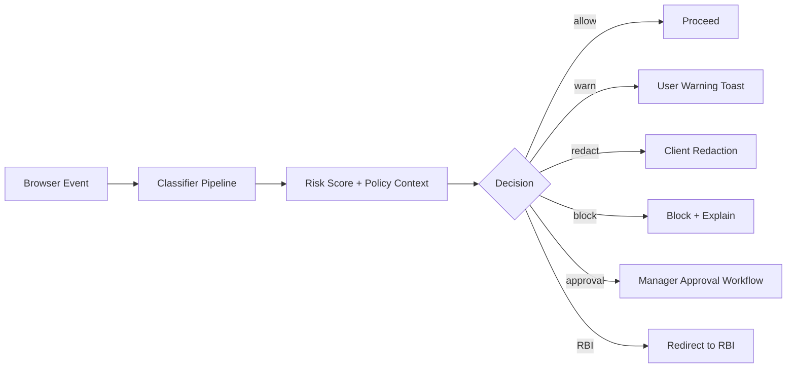

# Deliverable 7: DLP Engine Design

## Scope Statement

This document defines Sentinel's multi-layer DLP engine, decision logic, UX behavior, feedback loop, and performance/privacy guardrails for browser-native data protection.

## 1. Classification Taxonomy

| Category | Examples | Default Action |
|---|---|---|
| PCI | PAN-like values, BIN patterns | block or require approval |
| Credentials | API keys, JWT, private keys | block |
| PII | email + national IDs | warn/block by policy |
| PHI | diagnosis and medical identifiers | block in non-approved apps |
| Internal Secrets | project IDs, source snippets, trade logic | warn/block |

## 2. Detection Layers

| Layer | Method | Target p95 |
|---|---|---|
| L1 Regex | curated high-signal patterns | <5ms |
| L2 EDM | salted hash dictionary matching | <8ms |
| L3 Fingerprinting | rolling/rabin hash document fragments | <10ms |
| L4 ML | ONNX inference for semantic labels | <20ms |
| L5 OCR | Tesseract + ONNX image extraction | async preferred; sync <40ms for small images |
| L6 GenAI Prompt | DOM interception + LLM prompt classifier | <25ms |

### Starter Regex Library (examples)

```regex
\b(?:4[0-9]{12}(?:[0-9]{3})?)\b                     # Visa-like PAN
\bAKIA[0-9A-Z]{16}\b                                 # AWS access key
\beyJ[A-Za-z0-9_-]{10,}\.[A-Za-z0-9_-]{10,}\.[A-Za-z0-9_-]{10,}\b  # JWT-like
-----BEGIN (?:RSA|EC|OPENSSH) PRIVATE KEY-----       # Private key header
```

## 3. Decision Engine



Actions supported: `allow`, `warn`, `redact`, `block`, `redirect_to_rbi`, `require_justification`, `require_approval`.

## 4. UX Specification (textual wireframes)

1. **Inline toast**: "Sensitive company secret detected. Action requires justification."
2. **Modal blocker**: includes reason code, matched classifier, policy owner.
3. **RBI redirect page**: one-click continue in isolated session.
4. **Manager approval card** (Slack/email): allow once, allow for 24h, deny.

## 5. False Positive Tuning Loop

| Step | Mechanism |
|---|---|
| Feedback capture | user marks "false positive" with context tags |
| Analyst review | triage queue with confidence distribution |
| Policy update | threshold/rule tuning in shadow mode |
| Retraining | weekly incremental model updates |
| Safety gate | regression test corpus + holdout precision minimum |

## 6. Bamboo Card-Specific Patterns

- Gift-card BIN ranges and issuer prefixes.
- Statero product codes and settlement identifiers.
- Internal project IDs and release codenames.

## 7. Custom Classifier Training

1. Tenant uploads labeled corpus (minimum 500 examples/class recommended).
2. Data sanitization and leakage scan.
3. Fine-tuning or threshold adjustment flow.
4. Shadow deployment.
5. Promote when precision/recall gates pass.

## 8. Privacy by Design

- Never persist raw matched secrets.
- Store only classifier metadata, confidence, action, and hashed context.
- Sensitive evidence access restricted by role and legal hold flags.

## 9. Threat Model

| Threat | Mitigation |
|---|---|
| Evasion by obfuscation | multi-layer detection incl. semantic models |
| Prompt injection to bypass checks | pre-send DOM hooks + rule hard blocks |
| Model poisoning | curated training pipeline + signed datasets |
| Data leakage in logs | strict redaction middleware |
| Decision latency abuse | bounded inference path + fallback actions |

## 10. Performance Budget and Measurement Plan

| Metric | Target | Measurement |
|---|---|---|
| Synchronous DLP verdict | <=50ms p95 | browser trace + service histogram |
| False positive rate (high-signal classes) | <3% after tuning | labeled incident review |
| Miss rate for seeded canary secrets | <1% | continuous canary campaign |

## 11. Compliance Mapping (sample)

| Framework Control | Sentinel Feature | Evidence | Coverage |
|---|---|---|---|
| ISO 27001:2022 A.8.12 | DLP content inspection | policy export + incident logs | fully |
| PCI DSS 4.0 Req 3/4 | PAN exfiltration prevention | DLP rule set + blocked incidents | contributes-to |
| GDPR Art.25 | data minimization logging | redaction config and audits | fully |

## 12. Assumptions & Open Questions

### Assumptions
1. Tenants can provide limited labeled datasets for tuning.
2. OCR-heavy checks default async for large objects.

### Open Questions
1. Which GenAI domains must be hardcoded in v1 managed list?
2. Are approval workflows required for all blocked classes or only selected ones?

**Deliverable 7 of 15 complete. Ready for Deliverable 8 — proceed?**
