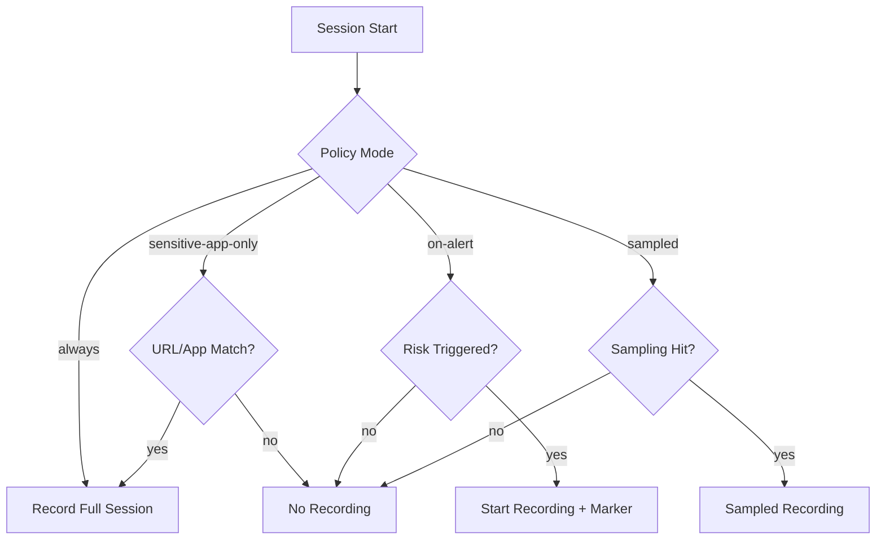

# Deliverable 8: Session Recording, Monitoring, and UEBA

## Scope Statement

This document defines Sentinel session capture, encryption/storage, playback, privacy controls, UEBA modeling, and SIEM/SOAR integrations.

## 1. Recording Modes Decision Tree

## 2. Capture Format

| Stream | Format |
|---|---|
| DOM | rrweb event stream |
| Video | WebCodecs fragments (H.264/VP9 by profile) |
| Keystroke | classified metadata only; sensitive fields masked |
| Network metadata | destination domain, bytes, policy action |

## 3. Encryption and Storage

- Per-session DEK: AES-256-GCM.
- DEK wrapped by tenant KMS key.
- Object storage on S3/MinIO with object lock (WORM).
- Lifecycle: hot 90 days, cold archive thereafter; legal hold override.

## 4. Playback

Features:
1. timeline scrub and speed controls
2. incident markers (DLP, policy blocks, risk spikes)
3. redaction overlays
4. forensic export package with integrity hashes

## 5. Privacy-Preserving Capture

| Control | Mechanism |
|---|---|
| password masking | HTML input type + selector-based redaction |
| payment field masking | regex + field metadata masks |
| custom selectors | tenant-configured CSS selectors for redaction |
| capture notice | policy-driven user notice banner |

## 6. Indexing and Search

- OCR index for key frame snapshots.
- Full-text indexing of DOM text after redaction.
- Query by user/device/domain/action/time range.

## 7. UEBA Design

### Baseline
- 7-30 day baseline per user and peer group.

### Features
- session duration
- login time and geo variance
- download/upload volume
- clipboard frequency
- policy trigger frequency

### Models
- Isolation Forest for anomaly outliers.
- Sequence model (LSTM-lite) for workflow deviation.
- Peer-group deviation scoring.

### Risk Score
- Output: 0-100 risk with feature attribution.
- Alert threshold default: 75.

## 8. Alert Fatigue Controls

- deduplicate correlated alerts per session.
- minimum confidence threshold and suppression windows.
- analyst feedback integrated into threshold tuning.

## 9. Integration Flow

| Destination | Payload |
|---|---|
| TheHive | alert with session ID, risk factors, links |
| Cortex | playbook trigger metadata |
| Wazuh/OpenSearch | searchable event and risk streams |

## 10. Threat Model

| Threat | Mitigation | Recovery |
|---|---|---|
| Recording tampering | object lock + hash chain | immutable restore |
| Unauthorized playback | strict RBAC + approval controls | access revoke + incident |
| Sensitive over-capture | redaction policy + classifier | purge request pipeline |
| Model drift | periodic retraining + quality checks | rollback model version |
| Alert storm | correlation + rate limits | degrade to essential signals |

## 11. Compliance Mapping (sample)

| Control | Feature | Evidence | Coverage |
|---|---|---|---|
| ISO 27001 A.8.16 | monitoring and activity logs | recording/audit exports | fully |
| PCI DSS Req 10 | activity tracking | immutable event chain | fully |
| GDPR Art.5 | minimization and retention | redaction + lifecycle config | partially |

## 12. Assumptions & Open Questions

### Assumptions
1. Session recording is policy-scoped, not universal by default.
2. Legal hold support is mandatory for enterprise tier.

### Open Questions
1. Which jurisdictions require explicit user consent banners by default?
2. Is keystroke metadata required in all tiers or enterprise only?

**Deliverable 8 of 15 complete. Ready for Deliverable 9 — proceed?**
