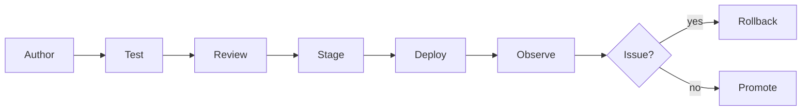

# Deliverable 9: Policy Engine & Natural-Language Authoring

## Scope Statement

This document specifies Sentinel policy language/runtime, lifecycle, testing strategy, conflict resolution, and natural-language compiler architecture.

## 1. Policy Runtime Decision

### ADR-09-01: Rego/OPA Primary
- **Context**: needs deterministic low-latency policy evaluation and auditable decisions.
- **Options**: Rego/OPA, Cedar, custom DSL engine.
- **Decision**: Rego/OPA primary, Cedar adapter optional.
- **Consequences**: rich ecosystem but steeper learning.
- **Rejected**: custom engine due verification burden; Cedar primary due AWS-coupling risk.
- **Revisit trigger**: policy authoring friction remains high after GUI/NL tooling rollout.

## 2. DSL Grammar (EBNF for Sentinel Wrapper)

```ebnf
policy      = "policy" identifier "{" rule+ "}" ;
rule        = "when" condition "then" action ;
condition   = expression { ("and" | "or") expression } ;
expression  = field operator value ;
action      = "allow" | "deny" | "warn" | "require_approval" | "redirect_rbi" ;
field       = "user.role" | "device.posture" | "resource.domain" | "event.type" ;
operator    = "==" | "!=" | "in" | "matches" | ">" | "<" ;
value       = string | number | list ;
```

## 3. Scope Model

`tenant -> org_unit -> team -> role -> user -> device -> session`

Evaluation follows inherited context with deny-overrides semantics.

## 4. Policy Bundle Lifecycle



## 5. GitOps Integration

- policy source in git repository per tenant.
- signed commits required for promotion.
- CI runs unit tests + regression suite + compile checks.

## 6. NL-to-Policy Compiler

| Stage | Description |
|---|---|
| Input | admin natural language request |
| Parser | constrained prompt to produce structured intent JSON |
| Validator | schema validation + forbidden pattern checks |
| Compiler | intent JSON -> Rego rules + tests |
| Simulator | shadow run impact report before apply |

Example:
- Input: "contractors cannot download files from GitHub."
- Output: Rego deny rule scoped to role=contractor and destination domain=github.com with action `deny`.

## 7. Shadow / Dry-Run Mode

- Policy evaluated and logged without enforcement.
- Impact report: affected users, events, potential false positives.
- Promotion gate requires acceptable impact threshold.

## 8. Conflict Resolution

| Strategy | Selected |
|---|---|
| deny-overrides | yes |
| allow-overrides | no |
| explicit priority tiers | yes (tenant > unit > team > user) |

## 9. Performance Budget

| Metric | Target |
|---|---|
| policy evaluation | `<10ms` p95 |
| bundle fetch | `<200ms` p95 |
| rollback activation | `<60s` globally |

## 10. Example Policy Set (10)

1. Block uploads of PCI patterns to unsanctioned domains.
2. Require justification for clipboard from finance apps.
3. Deny downloads on unmanaged devices.
4. Redirect high-risk domains to RBI.
5. Permit developers to push to approved repos only.
6. Require manager approval for source archive exports.
7. Force MFA re-check for privileged admin actions.
8. Restrict login by geo policy.
9. Disable extension install outside allowlist.
10. Enforce work profile border/watermark for sensitive apps.

## 11. Threat Model

| Threat | Mitigation |
|---|---|
| policy injection | schema + static validation + code review |
| privilege escalation via scope abuse | hierarchical auth checks |
| policy drift | signed bundle hash checks |
| compiler hallucination | deterministic output schema + tests |
| rollback abuse | dual-control approval for emergency rollback |

## 12. Assumptions & Open Questions

### Assumptions
1. Security admins can adopt policy-as-code with guided UX.
2. Shadow mode is acceptable as mandatory step for high-impact policies.

### Open Questions
1. Which policy changes require two-person approval in all tiers?
2. Is tenant-level custom DSL exposure needed or Rego-only under hood?

**Deliverable 9 of 15 complete. Ready for Deliverable 10 — proceed?**
