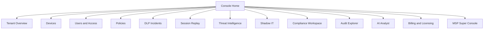

# Deliverable 10: Admin Console, End-User UX, MSP Console, and Mobile Specs

## 1. Scope Statement
This deliverable defines information architecture, role-based permissions, core user journeys, accessibility, and mobile integration for NNSEC Sentinel across tenant admins, analysts, compliance teams, MSP operators, and end users.

## 2. Stack and Frontend Architecture

| Layer | Selection | Rationale |
|---|---|---|
| Framework | Next.js 15 (App Router) | Server components for scalable dashboard rendering |
| Language | TypeScript 5.x | Type-safe API contracts |
| UI | shadcn/ui + Tailwind CSS | Fast, accessible enterprise components |
| Data Fetching | TanStack Query | Cache + retry + background refresh |
| Client State | Zustand | Lightweight scoped state |
| Auth | OIDC via Keycloak + PKCE | Unified with Sentinel identity |
| Audit | Event bus to Audit Log Service | Every critical action traceable |

## 3. IA and Navigation

## 4. RBAC Matrix

| Action | Super Admin | Tenant Admin | Security Admin | Compliance Officer | Helpdesk | MSP Partner Admin | Auditor |
|---|---:|---:|---:|---:|---:|---:|---:|
| Manage tenant settings | Y | Y | N | N | N | Y | N |
| Deploy policies | Y | Y | Y | N | N | Y | N |
| Approve DLP justification | Y | Y | Y | N | N | Y | N |
| View session replay | Y | Y | Y | Y | Limited | Y | Read-only |
| Export compliance evidence | Y | Y | N | Y | N | Y | Y |
| Manage billing | Y | Y | N | N | N | Y | N |
| Cross-tenant view | Y | N | N | N | N | Y | N |

## 5. Key Screen Specifications

### 5.1 Tenant Overview
- KPI cards: protected sessions, blocked threats, DLP incidents, policy health.
- p95 data freshness: < 30s.
- Drilldown: by org unit, team, geography.

### 5.2 Policy Authoring
- Tabs: Visual Builder, Natural Language, YAML/Rego source.
- Shadow mode toggle and impact preview.
- Signed deploy workflow with two-person approval.

### 5.3 DLP Incident Queue
- Columns: severity, data class, destination app, user, disposition.
- Actions: assign, approve, block retroactively, notify manager.
- SLA banners for overdue incidents.

### 5.4 Session Replay Viewer
- Timeline + event markers (download/upload/clipboard/policy hit).
- Redaction overlays render before frame decode.
- Legal hold lock indicator.

### 5.5 Threat Map
- Geo-aggregation by egress PoP and destination ASN.
- Time window controls (15m, 1h, 24h, 7d).

### 5.6 Dark Web Alerts
- Credential leak feed with exposure age and confidence.
- Playbook button to force reset + invalidate sessions.

### 5.7 Shadow IT Workspace
- Discovered app inventory, OAuth grants, app risk score.
- Policy action: sanction, monitor, block.

### 5.8 Compliance Workspace
- Framework > control > evidence hierarchy.
- Auto-generated evidence packs for ISO 27001, PCI DSS, SOC 2.

### 5.9 Merkle Audit Explorer
- Query by actor/action/resource/time.
- Merkle proof verification UI and blockchain anchor status.

### 5.10 AI Analyst Chat
- Grounded answers over approved telemetry indexes.
- Action proposals require explicit human approval.

### 5.11 MSP Master Console
- Tenant picker with strict isolation.
- Per-tenant branding and feature entitlements.

### 5.12 Billing and Licensing
- Seat usage, overage trend, invoice status.
- Offline token management for air-gapped deployments.

## 6. End-User Browser UX

### 6.1 First-Run Onboarding
1. User signs in with enterprise IdP.
2. Device posture check runs.
3. Policy bundle fetched and pinned.
4. Work profile activated with persistent border indicator.

### 6.2 Work/Personal Profile Split
- Blue border equivalent for managed profile.
- Copy/paste and downloads governed only in managed profile.
- Explicit cross-profile warnings.

### 6.3 Permission Prompts
- Policy-aware permission modals for clipboard, downloads, screenshots.
- Blocking reason references policy ID and remediation steps.

### 6.4 Password Vault UX
- In-browser vault panel with origin-verified autofill.
- Passkey enrollment and hardware key prompts.

### 6.5 Connection State Bar
- VPN/ZTNA status, gateway region, threat blocks count, DLP mode.

## 7. Mobile UX and Management

| Platform | Core Integration | UX Constraints |
|---|---|---|
| iOS | MDM-managed app config + Network Extension | No global screenshot prevention; app-level controls only |
| Android | Work Profile + Managed Config + FLAG_SECURE | BYOD split-profile strongly supported |

## 8. Internationalization and Accessibility

### 8.1 i18n
- v1 languages: English.
- roadmap: Arabic, Russian, Turkish, Azerbaijani, Hindi, Mandarin.
- Key requirement: bi-directional layout support for Arabic.

### 8.2 Accessibility
- WCAG 2.2 AA baseline across all screens.
- Critical flows targeted toward AAA where feasible:
  - incident response,
  - policy rollback,
  - emergency lockout.

## 9. UX Performance Budgets

| Metric | Target |
|---|---|
| Initial dashboard paint | < 1.5s p75 (enterprise WAN) |
| Screen transition | < 300ms p95 |
| Incident list query | < 400ms p95 |
| Replay seek latency | < 700ms p95 |

## 10. Assumptions and Open Questions

### 10.1 Assumptions
- Existing enterprise users are familiar with SOC tooling patterns.
- Keycloak branding can be customized per tenant for SSO consistency.

### 10.2 Open Questions
- Which exact data visualizations are mandatory for Bamboo Card board reporting?
- Should MSP super console support delegated tenant admin login tokens?
