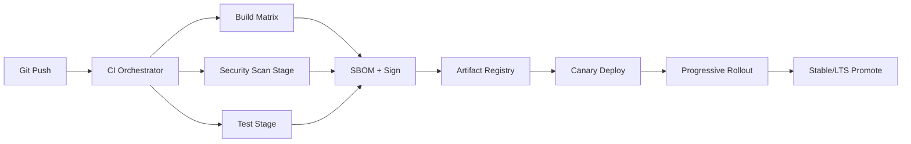

# Deliverable 12 - DevSecOps, SDLC, and Release Engineering

## Scope
This document defines the engineering execution system for NNSEC Sentinel from commit to customer rollout. It covers repository topology, CI/CD, supply-chain controls, security gates, rollout channels, observability and SRE operational model.

## 12.1 Monorepo Layout

```text
sentinel/
  chromium/                     # Chromium fork as git submodule
  platform/
    backend/
      identity-broker/
      policy-engine/
      dlp-service/
      telemetry-ingest/
    web/
      admin-console/
      msp-console/
    agents/
      posture-agent-go/
      desktop-native-host/
    libs/
      policy-sdk/
      telemetry-schema/
      crypto-sdk/
    infra/
      terraform/
      helm/
      kustomize/
    docs/
      deliverables/
  .github/workflows/
  justfile
  Makefile
```

### ADR-12-01: Chromium as submodule
| Field | Detail |
|---|---|
| Context | Chromium history and tooling differs from product app code |
| Options | (1) Single giant repo, (2) Separate repos, (3) Monorepo + submodule |
| Decision | Monorepo + Chromium submodule |
| Consequences | Better separation, easier CI targeting; submodule discipline required |
| Revisit trigger | If submodule coordination exceeds 15% release overhead |

## 12.2 Git Model and Release Cadence
- Trunk-based development on `master`
- Feature branches: `fd/<topic>-a96c`
- Release trains:
  - `canary`: daily
  - `dev`: 2/week
  - `beta`: weekly
  - `stable`: every 2 weeks
  - `lts`: every 12 weeks

### Controls
- Required signed commits for policy bundles
- CODEOWNERS gates on security-sensitive paths
- Mandatory threat-model note in PR template

## 12.3 CI/CD Pipeline Architecture



### Build Matrix
| Target | Toolchain | Caching |
|---|---|---|
| Linux x86_64 | Docker + BuildKit | layer cache + ccache |
| Linux arm64 | QEMU cross-build | buildx cache |
| Windows | MSVC + Ninja | sccache |
| macOS | Xcode + Ninja | ccache |
| Android | Gradle | remote gradle cache |
| iOS | Xcode Cloud/self-hosted runners | derived data cache |

## 12.4 Security Gates

| Gate | Tool | Fail Criteria | SLA Owner |
|---|---|---|---|
| SAST | Semgrep | High severity findings | AppSec lead |
| Code quality | SonarQube CE | Quality gate fail | Engineering manager |
| Container scan | Trivy + Grype | Critical CVEs | Platform sec |
| DAST | OWASP ZAP | Authenticated high risk | QA security |
| IaC scan | Checkov + tfsec | High misconfig | Cloud sec |
| Secrets | gitleaks | Any hardcoded secret | PR author |
| Web exposure | Nuclei | Critical template hit | SecOps |

## 12.5 SBOM, Signing, and Provenance
- SBOM formats: CycloneDX + SPDX per artifact
- Container signing: Cosign keyless + Rekor transparency
- Binary signing:
  - Windows EV Authenticode
  - Apple Developer ID + notarization
  - Linux GPG detached signatures
- Provenance target: SLSA L3 for backend and agent modules

## 12.6 Rollout Strategy and Flags
- Progressive rollout: 1% -> 5% -> 20% -> 100%
- Soak window per step: minimum 24h; stable soak 7-14 days
- Feature flags: self-hosted Unleash (default), LaunchDarkly for enterprise override
- Kill switches:
  - Browser build rollback by channel
  - Policy bundle emergency disable
  - DLP fail-open to fail-closed bounded mode toggle

## 12.7 Observability Blueprint
- OpenTelemetry instrumentation everywhere
- Traces: Tempo
- Metrics: Prometheus + Mimir
- Logs: Loki or OpenSearch (tenant-isolated index strategy)
- Dashboards:
  - build failure rates
  - rollout regressions
  - security gate trendline

## 12.8 SLO and Error Budget Model
| Service | SLO | Error Budget | Burn Alert |
|---|---|---|---|
| Policy decision API | 99.95% | 21.6 min/mo | 10% in 1h |
| DLP scan sync path | 99.9% | 43.2 min/mo | 15% in 2h |
| Admin console API | 99.9% | 43.2 min/mo | 10% in 4h |
| Update service | 99.95% | 21.6 min/mo | 5% in 1h |

## 12.9 On-Call and Incident Operations
- Follow-the-sun rotation: Dubai + EU
- Paging: PagerDuty with severity matrix
- Incident severities:
  - Sev1: customer-impacting security/control outage
  - Sev2: partial degradation with workaround
  - Sev3: minor functionality regression
- Tabletop cadence: monthly scenario runs

## 12.10 Threat Model (DevSecOps Pipeline)
| Threat | Category | Detection | Mitigation |
|---|---|---|---|
| Supply-chain dependency hijack | Tampering | SBOM diff + sig verify | pin + verify signatures |
| CI credential theft | Elevation | IAM anomaly alerts | short-lived OIDC tokens |
| Artifact substitution | Tampering | checksum mismatch | immutable registry + signatures |
| Malicious insider commit | Repudiation | audit trails | signed commits + reviews |
| Pipeline DoS | Availability | queue saturation metrics | autoscale runners + quotas |

## 12.11 Failure Modes and Recovery
| Failure | Detection | Recovery |
|---|---|---|
| Runner fleet outage | CI queue timeout | fallback runner pool in secondary region |
| Registry unavailability | artifact publish errors | failover to mirrored registry |
| Scanner false positives block release | gate trend spike | security override board with 2-approver model |
| Rollout bug in canary | SLO burn | auto-halt and rollback |

## 12.12 Performance Budgets
| Stage | Budget |
|---|---|
| PR CI feedback | <= 15 min p95 |
| Full release pipeline | <= 60 min p95 |
| Critical hotfix path | <= 30 min p95 |
| SBOM generation | <= 2 min per artifact |

## Assumptions and Open Questions
### Assumptions
- Self-hosted CI runners are allowed in isolated VPCs.
- Security scanner licenses can be phased where open-source is insufficient.

### Open Questions
- Should stable releases be frozen during regional holiday blackout windows?
- Is a dedicated release manager role needed before Month 9?
