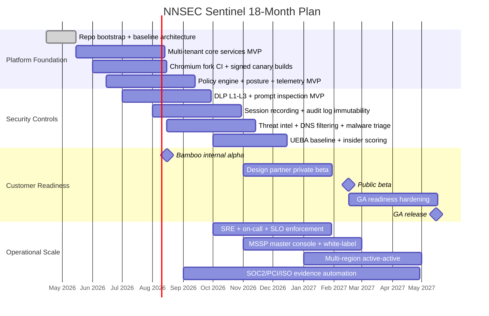
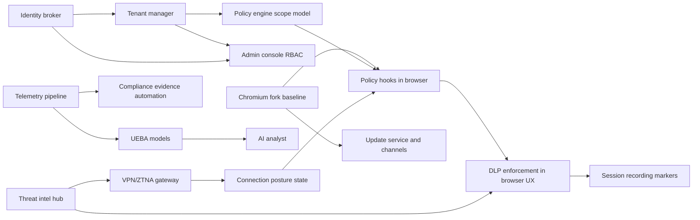

# Deliverable 14: 18-Month Engineering Roadmap and Risk Register

## 14.1 Scope
This document defines quarter-by-quarter execution for NNSEC Sentinel across product, platform, compliance, GTM readiness, and operational scale-up. It includes hiring, milestones, dependency graph, budget sensitivity model, and an actionable top-25 risk register with owners and residual risk.

## 14.2 18-Month Gantt (Quarter-by-Quarter)

## 14.3 Milestones, Acceptance Criteria, and Go/No-Go Gates

| Milestone | Target Quarter | Acceptance Criteria | Gate |
|---|---:|---|---|
| M1 Architecture Freeze v1 | Q2 2026 | ADR set complete, threat model >30 threats, CI builds on 3 platforms | Go if all P0 risks mitigated; no-go if architecture unknowns >10 |
| M2 Internal Alpha (Bamboo) | Q3 2026 | 150 pilot users, policy fetch p95 <200ms, DLP false positive <8% | Go if stability >99.5%; no-go if incident severity 1 unresolved |
| M3 Private Beta (3–5 orgs) | Q4 2026 | Multi-tenant isolation tests passed, onboarding <2 business days/tenant | Go if tenant isolation clean; no-go if cross-tenant data leakage |
| M4 Public Beta | Q1 2027 | Self-service tenant provisioning, documented runbooks, support SLA live | Go if p95 API latency <250ms at 5k concurrent; no-go if rollback unreliable |
| M5 GA | Q2 2027 | Security audit complete, release process deterministic, customer references | Go if severity-1 backlog = 0 for 30 days; no-go otherwise |

## 14.4 Hiring Plan

| Role | Seniority | Location | Start Quarter | Primary Mandate |
|---|---|---|---|---|
| Chromium Engineer | Senior | EU/Eastern Europe | Q2 2026 | Browser fork, patch maintenance, performance |
| Backend Platform Engineer | Senior | Dubai/Baku | Q2 2026 | Policy, tenant, identity, core APIs |
| Frontend Engineer | Mid/Senior | Baku | Q3 2026 | Admin console, replay viewer |
| Frontend Engineer | Mid/Senior | Remote EU | Q3 2026 | MSP console, UX quality |
| DevSecOps Engineer | Senior | Dubai | Q3 2026 | CI/CD, SLSA, supply-chain hardening |
| Mobile Engineer | Mid/Senior | Remote | Q3 2026 | iOS/Android managed app components |
| ML/AI Engineer | Senior | Remote | Q4 2026 | UEBA, DLP tuning, AI analyst |
| Platform Lead | Principal | Dubai | Q4 2026 | Architecture governance, ADR quality |
| SRE Engineer | Senior | Baku | Q4 2026 | SLOs, operations, incidents |
| SRE/Support Engineer | Mid | Dubai | Q1 2027 | Customer support runbooks, field ops |

## 14.5 Dependency Graph

## 14.6 Top 25 Risks (L×I, Mitigation, Owner, Residual)

| # | Risk | L (1–5) | I (1–5) | Score | Mitigation | Owner | Residual Risk |
|---:|---|---:|---:|---:|---|---|---|
| 1 | Chromium patch drift during CVE surge | 4 | 5 | 20 | Weekly upstream rebase, CI patch validation, hotfix lane | Chromium Lead | Medium |
| 2 | Linux screenshot blocking limits on Wayland | 5 | 3 | 15 | Honest control model, compositor guidance, policy fallback | Endpoint Lead | Medium |
| 3 | Cross-tenant data leakage bug | 2 | 5 | 10 | RLS policies, integration tests, external pen-test | Platform Lead | Low |
| 4 | DLP false positives cause user revolt | 4 | 4 | 16 | Shadow mode, tuning, explainability, appeal flow | DLP Lead | Medium |
| 5 | DLP false negatives leak sensitive data | 3 | 5 | 15 | Layered detection, periodic red-team, canary datasets | Security Lead | Medium |
| 6 | AI policy compiler produces unsafe rules | 3 | 4 | 12 | Human approval required, policy tests, deny-safe defaults | Policy Lead | Low |
| 7 | RBI cost explosion at scale | 3 | 4 | 12 | Selective RBI only, GPU scheduling, budget alarms | SRE Lead | Medium |
| 8 | macOS notarization signing pipeline failures | 3 | 3 | 9 | Redundant cert custody, automation, rotation drills | Release Engineer | Low |
| 9 | WireGuard gateway outages in one region | 3 | 4 | 12 | Active-active, health checks, failover runbooks | Network Lead | Low |
| 10 | Keycloak outage blocks auth | 3 | 4 | 12 | HA cluster, read-only token grace windows | Identity Lead | Medium |
| 11 | Kafka backlog growth under incident storm | 4 | 3 | 12 | Autoscaling, lag alarms, load shedding policies | Data Pipeline Lead | Medium |
| 12 | OpenSearch storage costs exceed model | 3 | 3 | 9 | Tiered storage, retention tuning | Finance + SRE | Low |
| 13 | Regulatory interpretation mismatch (UAE PDPL) | 2 | 4 | 8 | Counsel review, local DPA clauses | Compliance Lead | Low |
| 14 | Incomplete PCI evidence mapping delays sales | 3 | 4 | 12 | Evidence-as-code, control owners, monthly review | GRC Lead | Low |
| 15 | High-severity dependency CVEs in chain | 4 | 4 | 16 | SBOM + scanning gates + patch SLAs | DevSecOps Lead | Medium |
| 16 | Limited Chromium talent hiring bottleneck | 4 | 4 | 16 | Early recruiting in specialized markets, contractor buffer | CTO | Medium |
| 17 | Customer demand for legacy IE/ActiveX compatibility | 2 | 3 | 6 | Explicit non-goal, app modernization advisory | Product Lead | Low |
| 18 | Browser extension ecosystem abuse | 4 | 4 | 16 | Signed allowlist-only store, runtime checks | Browser Security Lead | Medium |
| 19 | Legal challenge on “Sentinel” naming | 3 | 3 | 9 | Trademark screening + fallback names | Legal | Low |
| 20 | Model hallucination in AI analyst summaries | 3 | 3 | 9 | Retrieval grounding, confidence labels, analyst signoff | AI Lead | Low |
| 21 | MSP white-label complexity delays launch | 3 | 4 | 12 | Phase features, template-driven branding | MSP Product Lead | Medium |
| 22 | Insider misuse of session recording access | 2 | 5 | 10 | Dual-control access, immutable logs, legal hold controls | Security Admin | Low |
| 23 | Poor mobile MDM integration adoption | 3 | 3 | 9 | Jamf/Intune reference profiles, support playbooks | Mobile Lead | Medium |
| 24 | Cost of global PoP rollout exceeds ARR pace | 3 | 4 | 12 | Hybrid partner PoP strategy, utilization thresholds | CFO + Network Lead | Medium |
| 25 | Incident response immaturity during beta | 3 | 5 | 15 | Tabletop drills, clear escalation, 24/7 pager rotation | CISO Office | Medium |

## 14.7 Budget Model (Quarterly OpEx/CapEx with Sensitivity)

### 14.7.1 Base Case (USD)

| Quarter | Headcount | OpEx Range | CapEx/One-off | Notes |
|---|---:|---:|---:|---|
| Q2 2026 | 2 | 120k–170k/mo | 80k–130k | initial infra, code-signing, legal setup |
| Q3 2026 | 6 | 210k–300k/mo | 120k–200k | PoC infra scale-up, private beta onboarding |
| Q4 2026 | 9 | 300k–420k/mo | 140k–240k | security audit prep, observability scale |
| Q1 2027 | 10 | 340k–470k/mo | 100k–180k | public beta, support + SRE maturity |
| Q2 2027 | 12 | 380k–540k/mo | 120k–220k | GA hardening, compliance attest costs |

### 14.7.2 Sensitivity Scenarios

| Scenario | Driver | Impact |
|---|---|---|
| Conservative | Slower customer onboarding, fewer PoPs | OpEx -15%, GTM slower |
| Base | Balanced engineering + design partner conversion | As above |
| Aggressive | Faster MSSP expansion + extra PoPs + premium support | OpEx +25–35%, potential ARR acceleration |

## 14.8 Key Metrics Dashboard

| Domain | Metric | Target by Private Beta | Target by GA |
|---|---|---:|---:|
| Engineering Velocity | Lead time for change | <4 days | <2 days |
| Reliability | Core API availability | 99.5% | 99.9% |
| Performance | Policy eval p95 | <10ms | <8ms |
| Security | MTTR for Sev-1 | <4h | <2h |
| Security | Unpatched critical vulns > SLA | 0 | 0 |
| Product | Admin weekly active rate | >70% | >80% |
| Product | End-user friction tickets / 100 users | <8 | <4 |
| DLP Quality | False positive rate | <8% | <4% |
| Sales | Pilot-to-paid conversion | >40% | >55% |
| Financial | Gross margin | >55% | >70% |

## 14.9 Assumptions and Open Questions

### Assumptions
1. Bamboo remains anchor tenant through GA validation period.
2. Global PoPs start as hybrid (AWS + partners) before own footprint expansion.
3. Sales engineering capacity grows alongside design partner count.

### Open Questions
1. Which partner regions are mandatory for first three paying enterprises?
2. Should MSSP tier include managed SOC analyst seats bundled by default?
3. What exact legal appetite exists for optional blockchain anchoring in all jurisdictions?
